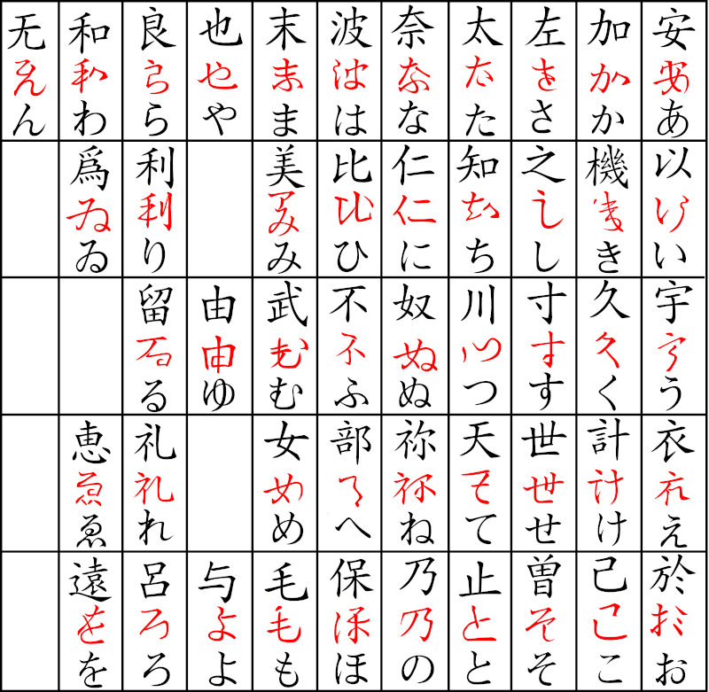

# Hiragana

A parte fonética e fonológica tem bastante peso pra se aprender um idioma de forma  plena, entretanto, para quem mal começou ou não tem muita proficiência na língua japonesa se torna apenas mais um peso ou carga não relevante em um primeiro contato. Logo, mesmo ao tratar sobre fonética de forma superficial, a primeira parte deste guia terá foco no sistema de escrita japonesa, e como tema do primeiro capítulo, falaremos primeiro de um dos três principais: o hiragana (平仮名).

- [Hiragana](#hiragana)
	- [Contextualização histórica](#contextualização-histórica)

## Contextualização histórica

O idioma japonês era inicialmente uma língua apenas falada – assim como a grande maioria das outras línguas –, mas diferente delas, demorou bastante pra adquirir uma forma de representação escrita, o que ocorreu apenas por volta do século IV.

O primeiro sistema de escrita utilizou como base os ***hanzi*** chineses – por isso muitas pessoas se referem aos ***kanji*** por caracteres ou ideogramas chineses – trazidos por monges budistas, que por conta disso, por muito tempo ficou conhecido apenas entre pessoas cultas e restrita a tratados do budismo e da filosofia. Ficou conhecido por ***kanji*** (漢字) e apenas durante o século VI, com a disseminação do budismo tendo ajuda até de algumas figuras coreanas importantes na época, como o sábio *Wang I*.

Durante a difusão do ***kanji*** a todos, a mais antiga coleção de poemas japoneses foi criada, o ***man’youshuu*** (万葉集) – literalmente “coleção das dez mil folhas” – foi criada, e deu origem a uma das primeiras representações escritas japonesas, o ***Man’yougana*** (万葉仮名). O ***man’yougana*** foi escolhido como representação por seu valor fonético, ou seja, seus caracteres eram utilizados como o ***katakana*** (片仮名) e o ***hiragana*** são atualmente.

Cada um dos retângulos menores da figura abaixo mostra os ***kanji*** do ***man’yougana*** em cima, sua versão cursiva no meio e o atual ***hiragana*** em baixo.

Devido as limitações fonéticas do idioma japonês em comparação ao chinês, vários ***kanji*** que deveriam ter pronúncias diferentes são iguais. Isso fez com que vários ideogramas pudessem representar o mesmo som e para decidir qual usar, os critérios eram de qual chegava mais perto de representar o sentido na palavra desejada.

De início, o hiragana não foi aceito por todos, pois muitos achavam que a língua culta deveria se restringir somente aos ideogramas. Como ele era uma escrita de aspecto mais cursivo, nem todos gostavam de utilizá-lo, porém se tornou preferência entre as mulheres, e por conta disto, foi conhecido na época por onnade (女手) – literalmente “mãos femininas”.

Uma das coisas que impulsionou o seu uso foi um romance chamado “O conto de Genji” (源氏物語) criado por uma escritora conhecida pelo pseudônimo Musarasaki Shikibu (紫式部) – também conhecida no ocidente por Lady Murasaki –. Considerado um patrimônio cultural por ser um dos primeiros romances da história, conta as aventuras políticas a amorosas de Genji, e curiosamente, tem cerca de 400 personagens em sua totalidade, mesmo que pouquíssimos dele sejam nomeados. Isso se dá ao fato de representar como era a convivência na sociedade imperial japonesa da época.

Em minha pesquisa inicial encontrei que como a publicação durou cerca de 50 anos, poderia ter sido dividido e publicado em mais de mil partes no total, mas com uma pesquisa mais aprofundada, não se chega a uma conclusão precisa de quantas partes os 54 capítulos tiveram.