[Voltar ao README 🡑](../README.md)

[Próximo capítulo »](lição02.md)

# **Hiragana**

A parte fonética e fonológica tem bastante peso pra se aprender um idioma de forma  plena, entretanto, para quem mal começou ou não tem muita proficiência na língua japonesa se torna apenas mais um peso ou carga não relevante em um primeiro contato.
Logo, mesmo ao tratar sobre fonética de forma superficial, a primeira parte deste guia terá foco no sistema de escrita japonesa, e como tema do primeiro capítulo, falaremos primeiro de um dos três principais: o ***hiragana*** (平仮名).

- [**Hiragana**](#hiragana)
	- [**Contextualização histórica**](#contextualização-histórica)
	- [**Os caracteres e seus fonemas**](#os-caracteres-e-seus-fonemas)
		- [**O Alfabeto Fonético Internacional**](#o-alfabeto-fonético-internacional)
		- [**Os caracteres あ, い, う, え e お**](#os-caracteres-あ-い-う-え-e-お)
		- [**Os caracteres da coluna do k**](#os-caracteres-da-coluna-do-k)
		- [**Os caracteres da coluna do s**](#os-caracteres-da-coluna-do-s)
		- [**Os caracteres da coluna do t**](#os-caracteres-da-coluna-do-t)
		- [**Os caracteres da coluna do n**](#os-caracteres-da-coluna-do-n)
		- [**Os caracteres da coluna do h**](#os-caracteres-da-coluna-do-h)
		- [**Os caracteres na coluna do m**](#os-caracteres-na-coluna-do-m)
		- [**Os caracteres na coluna do y**](#os-caracteres-na-coluna-do-y)
		- [**Os caracteres na coluna do r**](#os-caracteres-na-coluna-do-r)
		- [**Os caracteres na coluna do w**](#os-caracteres-na-coluna-do-w)
		- [**O caractere ん**](#o-caractere-ん)
		- [**A ordem alfabética**](#a-ordem-alfabética)
	- [**A ordem do traçado**](#a-ordem-do-traçado)
		- [**Os caracteres あ, い, う, え e お**](#os-caracteres-あ-い-う-え-e-お-1)
		- [**Os caracteres da coluna do k**](#os-caracteres-da-coluna-do-k-1)
		- [**Os caracteres da coluna do s**](#os-caracteres-da-coluna-do-s-1)
		- [**Os caracteres da coluna do t**](#os-caracteres-da-coluna-do-t-1)
		- [**Os caracteres da coluna do n**](#os-caracteres-da-coluna-do-n-1)
		- [**Os caracteres da coluna do h**](#os-caracteres-da-coluna-do-h-1)
		- [**Os caracteres na coluna do m**](#os-caracteres-na-coluna-do-m-1)
		- [**Os caracteres na coluna do y**](#os-caracteres-na-coluna-do-y-1)
		- [**Os caracteres na coluna do r**](#os-caracteres-na-coluna-do-r-1)
		- [**Os caracteres da coluna do w e ん**](#os-caracteres-da-coluna-do-w-e-ん)
- [**Notas finais**](#notas-finais)
- [**Para exercitar a leitura**](#para-exercitar-a-leitura)

## **Contextualização histórica**

O idioma japonês era inicialmente uma língua apenas falada – assim como a grande maioria das outras línguas –, mas diferente delas, demorou bastante pra adquirir uma forma de representação escrita, o que ocorreu apenas por volta do século IV.

O primeiro sistema de escrita utilizou como base os ***hanzi*** chineses – por isso muitas pessoas se referem aos ***kanji*** por caracteres ou ideogramas chineses – trazidos por monges budistas, que por conta disso, por muito tempo ficou conhecido apenas entre pessoas cultas e restrita a tratados do budismo e da filosofia.
Ficou conhecido por ***kanji*** (漢字) e apenas durante o século VI, com a disseminação do budismo tendo ajuda até de algumas figuras coreanas importantes na época, como o sábio *Wang I*.

Durante a difusão do ***kanji*** a todos, a mais antiga coleção de poemas japoneses foi criada, o ***man’youshuu*** (万葉集) – literalmente “coleção das dez mil folhas” – foi criada, e deu origem a uma das primeiras representações escritas japonesas, o ***Man’yougana*** (万葉仮名).
O ***man’yougana*** foi escolhido como representação por seu valor fonético, ou seja, seus caracteres eram utilizados como o ***katakana*** (片仮名) e o ***hiragana*** são atualmente.

Cada um dos retângulos menores da figura abaixo mostra os ***kanji*** do ***man’yougana*** em cima, sua versão cursiva no meio e o atual ***hiragana*** em baixo.

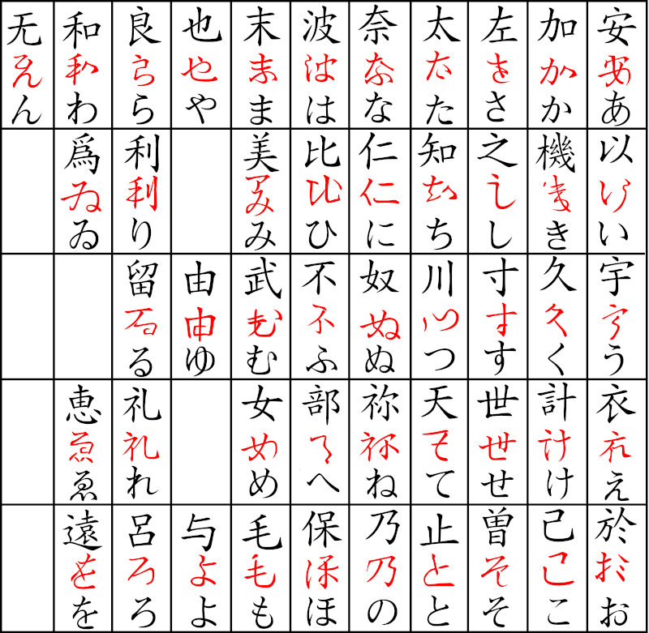

Devido as limitações fonéticas do idioma japonês em comparação ao chinês, vários ***kanji*** que deveriam ter pronúncias diferentes são iguais.
Isso fez com que vários ideogramas pudessem representar o mesmo som e para decidir qual usar, os critérios eram de qual chegava mais perto de representar o sentido na palavra desejada.

De início, o ***hiragana*** não foi aceito por todos, pois muitos achavam que a língua culta deveria se restringir somente aos ideogramas.
Como ele era uma escrita de aspecto mais cursivo, nem todos gostavam de utilizá-lo, porém se tornou preferência entre as mulheres, e por conta disto, foi conhecido na época por onnade (女手) – literalmente “mãos femininas”.

Uma das coisas que impulsionou o seu uso foi um romance chamado “O conto de Genji” (源氏物語) criado por uma escritora conhecida pelo pseudônimo Musarasaki Shikibu (紫式部) – também conhecida no ocidente por Lady Murasaki.
Considerado um patrimônio cultural por ser um dos primeiros romances da história, conta as aventuras políticas a amorosas de Genji, e curiosamente, tem cerca de 400 personagens em sua totalidade, mesmo que pouquíssimos dele sejam nomeados.
Isso se dá ao fato de representar como era a convivência na sociedade imperial japonesa da época.

Em minha pesquisa inicial encontrei que como a publicação durou cerca de 50 anos, poderia ter sido dividido e publicado em mais de mil partes no total, mas com uma pesquisa mais aprofundada, não se chega a uma conclusão precisa de quantas partes os 54 capítulos tiveram.

## **Os caracteres e seus fonemas**

Chegou a parte de finalmente mostrar os caracteres do ***hiragana***, então sem fazer  suspense, estão representados na seguinte tabela:

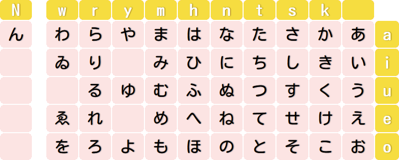

A tabela está disposta na forma da escrita tradicional japonesa, de cima pra baixo e da direita para a esquerda, ou seja, a ordem correta para ser lida é あ, い, う, え, お, か, き, く, け, こ, e assim por diante.

Como podemos ver, há vogais do nosso alfabeto do lado direito da tabela e consoantes no topo de cada coluna.
O ***hiragana*** é um silabário, em que cada caractere é um par de uma consoante e uma vogal, a consoante da coluna do **k** com a vogal da linha do **a** – as linhas também podem ser chamadas de だん, ou seja, aqui cabe あだん – tem o caractere か e a pronúncia dele é **ka**.
Isso indica que os caracteres na mesma linha tem o mesmo som vocálico e os da mesma coluna possuem o mesmo som consonantal, mas existem algumas exceções.

### **O Alfabeto Fonético Internacional**

Como existem alguns sons no japonês que não existem no português, utilizaremos o Alfabeto Fonético Internacional (AFI).
Como o objetivo deste guia não é ser um curso de fonética ou fonologia, de modo grosseiro e resumido, é um sistema de notação padronizada que associa um símbolo, que ao saber cada par símbolo-som, saiba como pronunciar a palavra associada ao conjunto de símbolos.
Por exemplo, para escrevermos a palavra **bato** (de bater) com o AFI, escrevemos [ˈbatu], ou de forma mais exata, [ˈbatʊ].
Se pararmos para analisar, na pronúncia mais geral que os brasileiros falam, não chega nem a ser o som de o, nem o som de u, e é justamente esse símbolo [ʊ].

Para escrever a palavra **corpo** com o AFI, escrevemos [ˈkoɾpu].
O símbolo associado ao [ɾ] é o som do r sem ser o do interior de São Paulo ou mineiro.

Para escrever a palavra **carro** com o AFI, escrevemos [ˈkahu].
O símbolo associado ao som o [h] é o som do r duplo ou no início de palavras como Requeijão.

O AFI Sempre é escrito entre colchetes e o apóstrofo é para indicar que a pronúncia da sílaba seguinte é mais forte.
Não se preocupem, este capítulo não terá foco em fonética ou fonologia voltada a língua japonesa, será apenas de forma superficial para nos orientarmos melhor em relação a pronúncia de cada caractere.

Para ter uma maior noção de como fazer cada som, o vídeo do canal sobre ***hiragana*** dá um bom norte, mas caso queiram ver como é o som produzido exatamente como um nativo, o canal [***Campanas the Japanese***](https://www.youtube.com/@campanasdejapanese) tem vários vídeos que especificam exatamente como produzir cada um dos sons associados a cada um desses símbolos.

### **Os caracteres あ, い, う, え e お**
O あ é lido como [a] do a em **gato**.

O い é lido como [i] do i em **igreja**.

O え é lido como [e] do e em **você**.

O お é lido como [o] do o em **capô**.

O som para o う não existe no português do Brasil, mas existe no português de Portugal, como no **e** da palavra **pegar**.
Apesar de não existir esse som no nosso idioma, ele não é algo de outro mundo, basta apenas fazer o som do **u**, mas em vez de fazer um arredondamento com os lábios, deixe-os abertos como ao dizer a letra **i**.
É representado por [ɯ].

### **Os caracteres da coluna do k**
Para a coluna do **k**, ele é igual ao do português, então, os caracteres か, き, く, け e こ são lidos respectivamente como [ka], [ki], [kɯ], [ke] e [ko].
A romanização é **ka**, **ki**, **ku**, **ke** e **ko**, respectivamente.

### **Os caracteres da coluna do s**
Para a coluna do **s** tem uma pequena mudança de som no し, esse som é representado por [ɕ] e é um som parecido com o **ch** na palavra **chinelo** do português do Brasil.
Então, os caracteres さ, し, す, せ e そ são lidos respectivamente como [sa], [ɕi], [sɯ], [se] e [so].
A romanização é **sa**, **shi**, **su**, **se** e **so**, respectivamente.

### **Os caracteres da coluna do t**
Na coluna do **t** tem duas mudanças, uma no ち e outra no つ.
Antes de explicar como produzimos estes sons, primeiro tenho que falar sobre vogal epentética.
Uma vogal epentética ocorre ao pronunciarmos o som de duas consoantes consecutivas e de forma não proposital, colocamos um som de **i** entre elas, como na palavra “algoritmo” que pronunciamos algo como “algorítimo”.
Esse **i** entre o **t** e o **m** na pronúncia do português do Brasil é uma vogal epentética.
Dado esse detalhe, o ち, que deveria tecnicamente ser o som do **ti** no sotaque de Recife, é a junção do som associado ao t com o som do しque acabamos de conhecer, ou seja, o ち faz o som de [tɕi].
O つ é o som do tsu em ***tsunami***, ou seja, [tsɯ], mas tentem fazer os dois sons sem produzir algo como [tɕi] ou [tisɯ], não produzam esse **i** como vogal epentética jamais.
た, ち, つ, て e と são lidos respectivamente como [ta], [tɕi], [tsɯ], [te] e [to].
A romanização é ta, chi, tsu, te e to, respectivamente.

### **Os caracteres da coluna do n**
Os sons são bem parecidos com o do **n** no português brasileiro mas no に é um pouquinho diferente – como dá pra ver, as mudanças quase sempre ocorrem na いだん.
Acho que esse é o único som que quem vir o vídeo do canal aprenderá bastante errado.
Ele é mais algo entre o nosso **n** e o **nh**.
É exatamente o som **ñ** do espanhol, **gn** em **lasagna** no italiano, no **gn** em ***hargneux*** no francês e é representado por [ɲ].
な, に, ぬ, ね e の são lidos respectivamente como [na], [ɲi], [nɯ], [ne] e [no].
A romanização é **na**, **ni**, **nu**, **ne** e **no**, respectivamente.

### **Os caracteres da coluna do h**
Nesse também a diferença tá na いだん e うだん.
O som em は, へ e ほ são exatamente como o som do r no início de palavras como **requeijão** ou em **rr** como em **arroz**, e esse símbolo fonético é representado por [h].
Já o ひ é um som que não existe no português mas não é difícil de reproduzi-lo, basta tentar fazer o som de **x** de xícara ao mesmo tempo que faz som de [h] e o símbolo pra esse som é um [ç] como em **cabeça**, apesar de a letra em português e o símbolo do AFI não representarem a mesma coisa.

O som do ふ parece bem difícil a um primeiro contato e resumidamente é algo entre um [fɯ] e um [hɯ], mas para ser mais precisamente por fazer um f mas sem encostrar o lábio inferior no dente, ou melhor, tentar o som de **f** com a boca na mesma formação de dizer a letra **a**.
Tem o símbolo [ɸ].
は, ひ, ふ, へe ほ são lidos respectivamente como [ha], [çi], [ɸɯ], [he] e [ho].
A romanização é **ha**, **hi**, **fu**, **he** e **ho**, respectivamente.

### **Os caracteres na coluna do m**
O som desse é igual ao do português.
ま, み, む, め e も são lidos respectivamente como [ma], [mi], [mɯ], [me] e [mo].
A romanização é **ma**, **mi**, **mu**, **me** e **mo**, respectivamente.

### **Os caracteres na coluna do y**
Essa coluna realmente só possui três caracteres, diferente das colunas anteriores.
Seu som é o mesmo [i], mas falado de forma mais rápida e seu símbolo fonético é [j] – assim como o ç na coluna do h, o som não é o mesmo do caractere no português.
Para ter noção de como distribuir o tempo desse som na pronúncia, imagine que a duração do som vocálico é o dobro do som do [j].
や, ゆ e よ são lidos respectivamente como [ja], [jɯ] e [jo].
A romanização é **ya**, **yu** e **yo**, respectivamente.

### **Os caracteres na coluna do r**
Essa coluna possui o mesmo som do **r** na palavra **oração**, mas não com o **r** do sotaque mineiro ou o do interior de São Paulo e seu símbolo fonético é [ɾ].
ら, り, る, れ e ろ são lidos respectivamente como [ɾa], [ɾi], [ɾɯ], [ɾe] e [ɾo].
A romanização é **ra**, **ri**, **ru**, **re** e **ro**, respectivamente.

### **Os caracteres na coluna do w**
O som dessa coluna começa com o mesmo som do う, porém, segue a mesma característica da coluna do y, de ser dito de forma mais transicional.
Seu símbolo fonético é [ɰ], justamente para indicar semelhança com o [ɯ].
わ, ゑ e ゐ são lidos como [ɰa], [ɰe] e [ɰi].
を é lido como [o], exatamente o mesmo de を.
Em capítulos posteriores entenderemos porque isso acontece.
A romanização é **wa** e **wo**.

> **Observação**:
> ゑ e ゐ são caracteres obsoletos. Não são mais usados atualmente, por consequência disso, só são encontrados em poemas, documentos ou textos antigos.

### **O caractere ん**
Esse é o ***hiragana*** mais estranho da tabela, por isso ele está separado, pois ele não faz par com vogal, e som dele muda dependendo de quem vez depois, mas para simplificar, é o mesmo de quando alguém faz uma pergunta e outra pessoa responder “hm” em confirmação.
Não é usado no começo das palavras e seu símbolo fonético é [N].
A romanização é **n**.

### **A ordem alfabética**
A equivalência a ordem alfabética para o ***hiragana*** é a mesma ordem de leitura da tabela, de cima pra baixo e da direita para a esquerda, então a ordem あ, い, う, え, お, か, き, く, け, こ, e assim por diante, sendo o ん o último.

Existe uma outra forma de ordenação, que se baseia em um poema conhecido por ***iroha*** (いろは) cujo primeiro registro de sua existência data de 1079 – é o poema na figura abaixo.
Ele é usado como ordenação pois as palavras nele estão dispostas de forma a aparecer todos os caracteres da tabela do ***hiragana*** – menos o ん por ser relativamente moderno – e que cada um só aparece uma única vez.

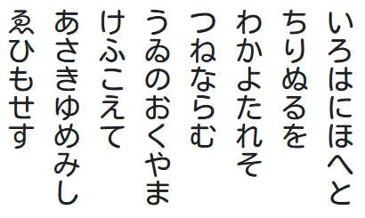

Como forma de ordenação é arcaica, mas ainda hoje podemos encontrá-la em uso, por exemplo, como denominação das notas musicais.
Perceba que por ser um poema arcaico, sua escrita está na forma tradicional e sua primeira estrofe possui sete caracteres, igual ao número de notas.
Lá, si, dó, ré, mi, fá e sol são respectivamente い, ろ, は, に, ほ, へ e と.

## **A ordem do traçado**
Se você já prestou atenção em pessoas escrevendo, deve ter percebido que algumas delas escrevem as letras em ordem dos traços de forma diferente.
Por exemplo, ao escrever uma letra que precisa fazer algum círculo como a letra **o**, algumas pessoas o escrevem no sentido horário, mas outras já o escrevem no sentido anti-horário e as duas estão certas.

No japonês, por incrível que pareça, existe uma ordem correta dos traços.
Devido a alguns caracteres serem mais complexos e que apesar de alguns serem parecidos, carregam um significado totalmente diferente, a ordem dos traços na escrita a mão influencia em como entendemos.
No ***hiragana*** não existem tantos caracteres que são parecidos, mas no ***katakana***, o sistema que aprenderemos no próximo capítulo possui vários parecidos entre si, como o ツ e o シ, então em textos manuscritos ajuda a entender qual é qual.

Os caracteres estarão em “ordem alfabética” e para ver com mais detalhes, acesse o site Japanese Lesson.
Lá também tem versões alternativas de traçados.

### **Os caracteres あ, い, う, え e お**
あ

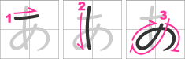

い

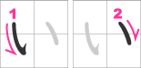

う

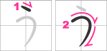

え

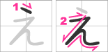

お

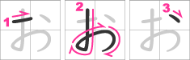

### **Os caracteres da coluna do k**
か

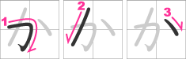

き

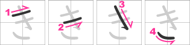

く

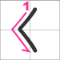

け

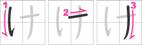

こ

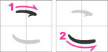

### **Os caracteres da coluna do s**
さ

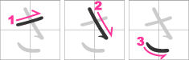

し

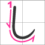

す

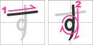

せ

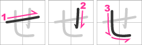

そ

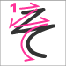

### **Os caracteres da coluna do t**
た

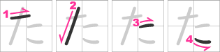

ち

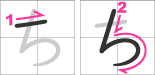

つ

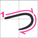

て

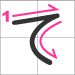

と

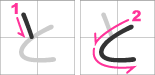

### **Os caracteres da coluna do n**
な

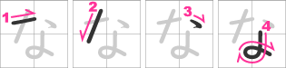

に

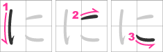

ぬ

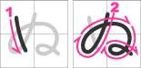

ね

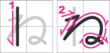

の

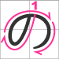

### **Os caracteres da coluna do h**
は

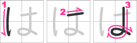

ひ

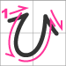

ふ

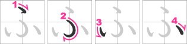

へ

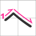

ほ

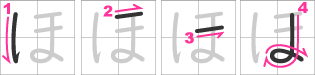

### **Os caracteres na coluna do m**
ま

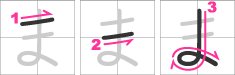

み

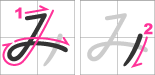

む

め

も

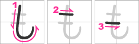

### **Os caracteres na coluna do y**
や

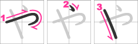

ゆ

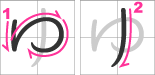

よ

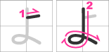

### **Os caracteres na coluna do r**
ら

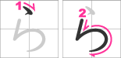

り

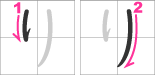

る

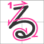

れ

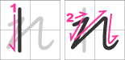

ろ

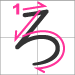

### **Os caracteres da coluna do w e ん**

わ

を

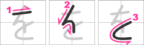

ん

# **Notas finais**
Chegamos ao final do primeiro capítulo do guia e espero que o conteúdo tenha sido repassado da forma mais clara possível, mesmo que tenha sido só o início da nossa jornada. 
Caso tenha interesse em se aprofundar mais sobre o conteúdo, utilize a seguinte lista com as principais referências utilizadas para construção deste capítulo:
1. Blog [***Ganbarou Ze* – Gramática Japonesa**](https://ganbarouze.blogspot.com/);
2. Site [***Japanese Lesson***](http://japanese-lesson.com/characters/hiragana/hiragana_writing.html).

# **Para exercitar a leitura**
|||||
|:-:|:-:|:-:|:-:|
いたす     | たく     | にもつ    | うち
あおい     | こい     | ひる      | かなめ
けい       | よし     | ぬれる    | ある
きく       | かいけつ  | おりる    | いいえ
つこむ     | まつり    | つき      | やわらかい
すくない   | とら      | むら      | とう
かんさつ   | かめ      | ほんとに  | れい
かたち     | ここ      | おくさん  | しかる
おこなう   | わるい    | もつ      | たいよう
すくう     | はし      | おりる    | きり
ていこう   | いなか    | きめる    | いいえ
せん       | むすめ    | とき      | まく
すむ       | はつ      | やね      | しゅちょう
いきる     | もゆの    | つま      | しはい
へいか     | そのまま  | なか      | ちゅうしん
たから     | いち      | なお      | しちうかい
つくえ     | もむ      | まいにち   | うかふ
ころ       | たのしむ  | みまわす   | なる
よむ       | こし      | とり      | すて
いよいよ   | とくに     | かける    | あつさり
みやる     | ふりかえる | ふる      | やつはり
いたい     | いよいよ   | ふるわせる | つくえ
いれる     | へいき     | もの      | カメラ
なし       | むく       | こめる    | かんし
せかい     | くるしい   | まわす     | かい
おとなしい | みかた     | こむ       | むこう
あしおと   | おす       | むすこ     | たてる
ふとん     | うける     | しょう     | とつせん
その       | なん       | つて      | おさない
いか       | にん       | ていこく  | なにもの
さく       | けん       | しる      | なんて
くせ       | ひてい     | むかし     | はる
たい       | にたいする | ちち       | いう
たつ       | ちんもく   | ほか       | ゆくえ
たいち     | あう       | しみん     | つふやく
ふれる     | かく       | はう       | いちけき

[Próximo capítulo »](lição02.md)

[Voltar ao README 🡑](../README.md)