[Voltar ao README 🡑](../README.md)

[« Capítulo anterior](lição01.md) | 
[Próximo capítulo »](lição03.md)

# **Lição 02: Katakana**
A primeira lição foi sobre um dos principais sistemas de escrita do japonês, o ***`hiragana`***.
Devido ao ***`katakana`*** ter vários pontos exatamente iguais a ele, muitos detalhes nas explicações serão mais breves por já terem sido apresentadas em mais detalhes no capítulo anterior, então, caso fique algo com um tom mais vago, basta reler o primeiro capítulo para relembrar com mais detalhes.
Não terá apenas o conteúdo fosse uma releitura do anterior, pois existem vários casos de usos do ***`katakana`*** que normalmente não se usa o ***`hiragana`***, mas vamos para a contextualização pra não enrolar demais.

- [**Lição 02: Katakana**](#lição-02-katakana)
	- [**Contextualização histórica**](#contextualização-histórica)
	- [**Os caracteres e seus fonemas**](#os-caracteres-e-seus-fonemas)
	- [**Alguns casos de uso no katakana**](#alguns-casos-de-uso-no-katakana)
	- [**A ordem do traçado**](#a-ordem-do-traçado)
		- [**Os caracteres ア, イ, ウ, エ e オ**](#os-caracteres-ア-イ-ウ-エ-e-オ)
		- [**Os caracteres da coluna do k**](#os-caracteres-da-coluna-do-k)
		- [**Os caracteres da coluna do s**](#os-caracteres-da-coluna-do-s)
		- [**Os caracteres da coluna do t**](#os-caracteres-da-coluna-do-t)
		- [**Os caracteres da coluna do n**](#os-caracteres-da-coluna-do-n)
		- [**Os caracteres da coluna do h**](#os-caracteres-da-coluna-do-h)
		- [**Os caracteres na coluna do m**](#os-caracteres-na-coluna-do-m)
		- [**Os caracteres na coluna do y**](#os-caracteres-na-coluna-do-y)
		- [**Os caracteres na coluna do r**](#os-caracteres-na-coluna-do-r)
		- [**Os caracteres da coluna do w**](#os-caracteres-da-coluna-do-w)
		- [**O caractere ン**](#o-caractere-ン)
- [**Notas finais**](#notas-finais)
- [**Para exercitar a leitura**](#para-exercitar-a-leitura)

## **Contextualização histórica**
Uma das formas de se referir ao ***`katakana`***, de forma parecida com o ***`hiragana`***, era 男手(おとこで).
Esse nome era justamente por ter se popularizado primeiro entre os homens, que tinham preferência por traços menos cursivos, e assim como o hiragana, ele também é resultado da simplificação de alguns ***`kanji`***, que estão na tabela abaixo.

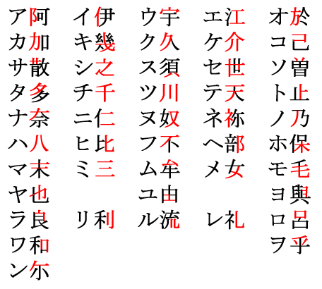

Diferente do ***`hiragana`***, que exige um pouco mais de imaginação para conseguirmos ver a semelhança entre os caracteres originais e os originados, conseguimos ver com bem mais facilidade a derivação no caso do ***`katakana`***, o que justifica até seu nome, que significa mais ou menos “pedaço de ***`kana`***”.

## **Os caracteres e seus fonemas**
Os sons e as características são exatamente as mesmas do ***`hiragana`***.
Como podemos ver na imagem a seguir, todas as posições são as mesmas, tanto as linhas relacionadas aos sons vocálicos, quanto a coluna relacionadas às consoantes, ou seja, a letra **`a`** com a coluna do **`n`** formam ナ que possui a mesma pronúncia de な.
Vamos seguir para deixar especificado.

A seguinte tabela está disposta na forma da escrita tradicional japonesa, de cima pra baixo e da direita para a esquerda, ou seja, a ordem correta para ser lida é ア, イ, ウ, エ, オ, カ, キ, ク, ケ, コ, e assim por diante.

ア, イ, ウ, エ e オ são lidos respectivamente como [a], [i], [ɯ], [e] e [o].

カ, キ, ク, ケ e コ são lidos respectivamente como [ka], [ki], [kɯ], [ke] e [ko].

サ, シ, ス, セ e ソ são lidos respectivamente como [sa], [ɕi], [kɯ], [ke] e [ko].

タ, チ, ツ, テ eト são lidos respectivamente como [tá], [tɕi], [tsɯ], [te] e [to].

ナ, ニ, ヌ, ネ e ノ são lidos respectivamente como [na], [ɲi], [nɯ], [ne] e [no].

ハ, ヒ, フ, ヘ e ホ são lidos respectivamente como [ha], [çi], [ɸɯ], [he] e [ho].

マ, ミ, ム, メ e モ são lidos respectivamente como [ma], [mi], [mɯ], [me] e [mo].

ヤ, ユ e ヨ são lidos respectivamente como [ja], [jɯ] e [jo].

ラ, リ, ル, レ e ロ são lidos respectivamente como [ɾa], [ɾi], [ɾɯ], [ɾe] e [ɾo].

ワ, ヰ, ヱ e ヲ são lidos respectivamente como [ɰa], [ɰi], [ɰe] e [o].

ン é lido como [N].

Tome cuidado pois alguns caracteres são bem semelhantes, alguns são apenas um pouco1, já outros são extremamente semelhantes.

> **Observações**:
> 1. Os pares ノ com メ, メ com ヌ, フ com ワ e ワ com ウ são semelhantes, então esses pares merecem uma atenção maior.
> 2. シ e ツ são extremamente parecidos, precisam de uma atenção redobrada.
Para facilitar a memorização, ao colocá-los um ao lado do outro vemos que, respectivamente, um parece um rostinho sorrindo pra cima e o outro parece um rostinho sorrindo pra esquerda.
> 3. ン são ソ são muito parecidos também então para facilitar a memorização, basta ter um pensamento análogo a raciocínio para os caracteres シ e ツ, porém com pensamento de em vez de ser uma carinha sorrindo com dois olhos, uma que possui apenas um olho.

## **Alguns casos de uso no katakana**
Os caracteres possuem os mesmos sons, mas utilização deles é um pouco diferente, pois existem alguns casos em que vemos o ***`katakana`*** na escrita japonesa.
A lista a seguir pontua alguns de seus casos de uso:

- **Onomatopeias**: palavras que representam sons, por exemplo ワンワン, que representa o som que o cachorro faz;
- Termos técnicos e científicos: por exemplo, Canis lupus familiaris (ケニス・ルプス・ファミリアリス) , nome científico do cachorro;
- **Nomes de corporações japonesas**: como a プレイステーション (PlayStation) e マクドナルド (Mc Donald);
- **Documentos oficiais anteriores a segunda guerra**: em documentos oficiais anteriores a 2ª Grande Guerra, ele era utilizado conjuntamente com o ***`hiragana`*** de forma comum;
- **Telegramas e computação**: na década de 1980, a maioria dos computadores os utilizava em vez de ***`kanji`*** e ***`hiragana`***;
- **Palavras sino-japonesas**: palavras como ラーメン (lamen) e カレー (curry), que são de origem chinesa;
- **Indicação de leitura *on***: para não adiantar muitos detalhes, ***`kanji`*** possuem algumas leituras, e uma delas é denominada leitura ***on***, e algumas vezes é possível encontrar ***`hiragana`*** ou ***`katakana`*** indicando a leitura, assim como já foi feito algumas vezes aqui neste material;
- **Indicação de pronúncia**: pode ser encontrada próximo aos ***`kanji`***, acima, ou do lado em um tamanho um pouco menor;
- **Modos de fala**: normalmente aparece quando um personagem não japonês fala algo, ou em alguns casos, até personagens não humanos, como robôs ou alienígenas;
- **Nomes pessoais**: normalmente se escreve o nome de pessoas estrangeiras em ***`katakana`***.

## **A ordem do traçado**
A ordem do traçado do katakana é bem mais importante em comparação a do hiragana, tudo devido a alguns caracteres serem bastante semelhantes. Visualmente eles são semelhantes, mas a ordem dos traços e posição são levemente diferentes para que isso também ajude a diferenciá-los.

### **Os caracteres ア, イ, ウ, エ e オ**
ア

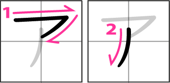

イ

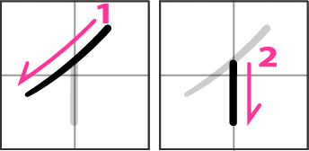

ウ

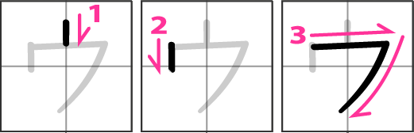

エ

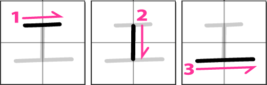

オ

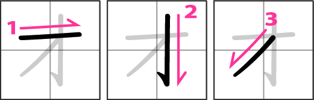

### **Os caracteres da coluna do k**
カ

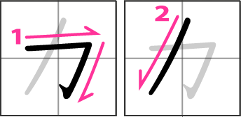

キ

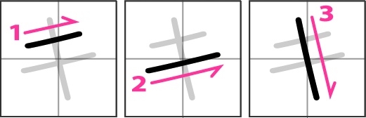

ク

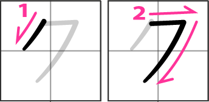

ケ

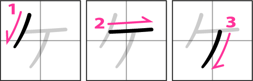

コ

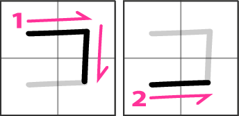

### **Os caracteres da coluna do s**
サ

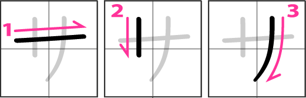

シ

ス

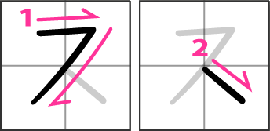

セ

ソ

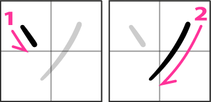

### **Os caracteres da coluna do t**
タ

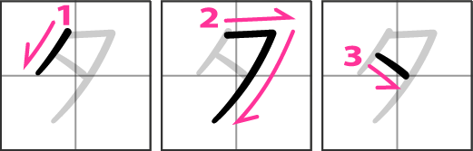

チ

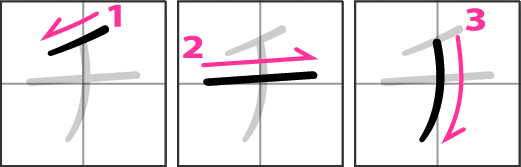

ツ

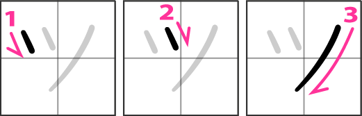

テ

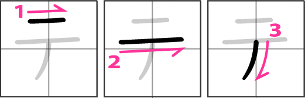

ト

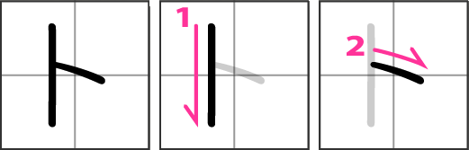

### **Os caracteres da coluna do n**
ナ

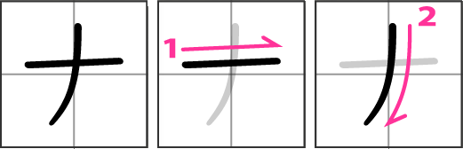

ニ

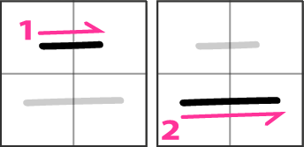

ヌ

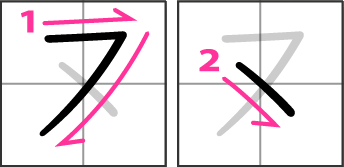

ネ

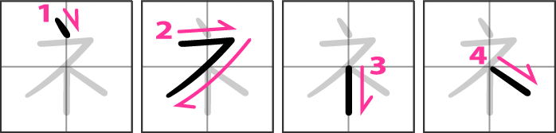

ノ

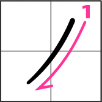

### **Os caracteres da coluna do h**
ハ

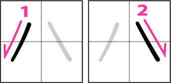

ヒ

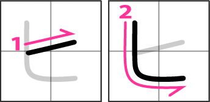

フ

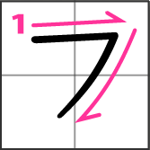

ヘ

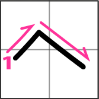

ホ

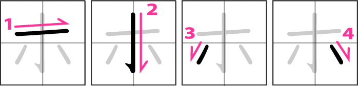

### **Os caracteres na coluna do m**
マ

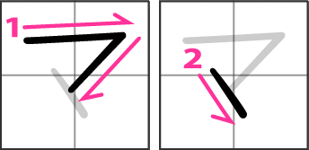

ミ

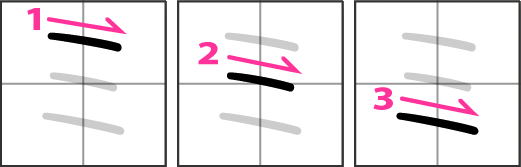

ム

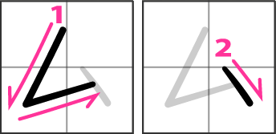

メ

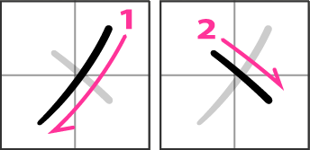

モ

### **Os caracteres na coluna do y**
ヤ

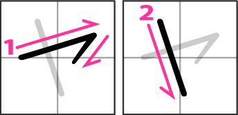

ユ

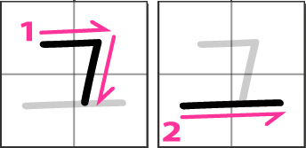

ヨ

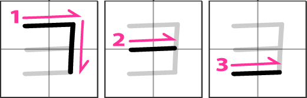

### **Os caracteres na coluna do r**
ラ

リ

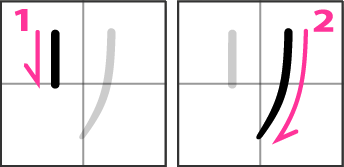

ル

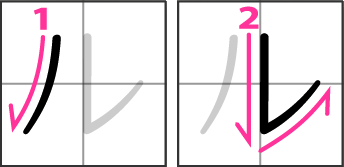

レ

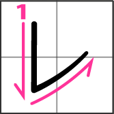

ロ

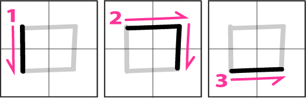

### **Os caracteres da coluna do w**

ワ

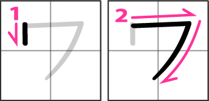

ヲ

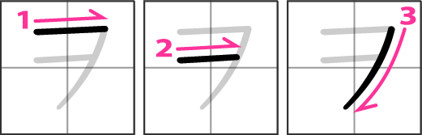

### **O caractere ン**
ン

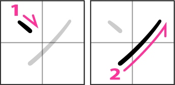

# **Notas finais**
Chegamos ao fim do segundo capítulo.
Como podemos ver o segundo capítulo foi levemente mais curto que o primeiro devido a uma boa parte do conteúdo ser reaproveitado, como a contextualização histórica e a introdução e a explicação em torno da representação fonética.
Por ser uma quantidade menor de conteúdo, não o ignore, pois ele é mais difícil de fixar devido à frequência do uso do ***`katakana`*** ser bem menor em comparação ao ***`hiragana`***.

Apesar de ter terminado a base dos dois ***`kana`***, ainda faltam alguns assuntos relacionados que trataremos no próximo capítulo, entre eles é como representar o som o **g**, **z**, **d** e vários outros.
Caso tenha interesse em se aprofundar mais sobre o conteúdo, utilize a seguinte lista com as principais referências utilizadas para construção deste capítulo:

1. Blog [***Ganbarou Ze* – Gramática Japonesa**](https://ganbarouze.blogspot.com/);
2. Site [***Japanese Lesson***](http://japanese-lesson.com/characters/katakana/katakana_writing.html).

# **Para exercitar a leitura**
|||||
|:-:|:-:|:-:|:-:|
ヨシ        | ショウ      | オス       | クセ
トキ        | イレル      | オリル     | イナカ
ナオ        | トラ        | トウ       | ツマ
コム        | フルワセル  | ヘイキ      | タイヨウ
コシ        | ナンテ      | ハシ       | ミヤル
ニタイスル  | ツフヤク     | モユノ     | ナル
イキル      | イイエ      | レイ       | コロ
キメル      | タツ        | マイニチ   | ソノママ
テイコク    | ハル        | ソノ       | キク
トツセン    | セン        | トリ       | スム
ムク        | ムスコ      | ヤツハリ   | キリ
ナン        | イイエ      | ムコウ     | ワルイ
オクサン    | シュチョウ   | ウカフ     | ヒテイ
イカ        | マク        | ツテ       | ムラ
シミン      | トクニ      | タイチ     | クルシイ
シハイ      | シル        | ステ       | マワス
コイ        | ヘイカ      | ミカタ     | カイ
ヌレル      | ツコム      | イチケキ   | モノ
ナカ        | ヤネ        | アオイ     | カンシ
アツサリ    | タク        | ツキ       | イヨイヨ
ヤワラカイ  | ナニモノ    | コメル      | アシオト
イタス      | タノシム    | カメ       | シチウカイ
ミマワス    | ニン        | イタイ     | モム
ハウ       | フレル       | ココ       | アウ
チュウシン  | オコナウ     | タテル     | ハツ
オトナシイ  | カナメ       | スクナイ   | ユクエ
カンサツ    | フトン       | サク      | カメラ
ツクエ      | ヒル        | フル       | ツクエ
ヨム       | ウチ         | タイ       | テイコウ
ケイ       | スクウ       | セカイ     | オリル
イウ       | フリカエル   | マツリ     | シカル
ムスメ     | オサナイ     | ホカ       | イヨイヨ
ニモツ     | チンモク     | ナシ       | カイケツ
アル       | カケル      | ケン        | カク
ホントニ   | チチ        | イチ        | ムカシ
ウケル     | カタチ      | ダカラ      | モツ

[« Capítulo anterior](lição01.md) | 
[Próximo capítulo »](lição03.md)

[Voltar ao README 🡑](../README.md)
