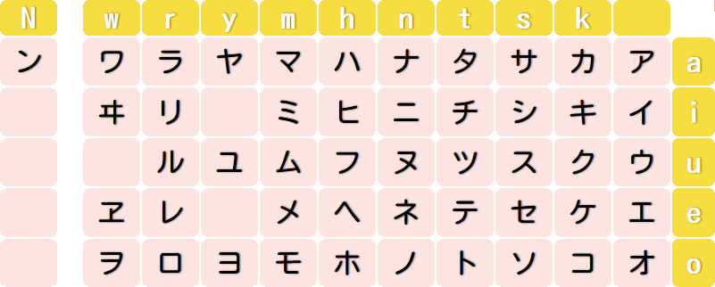

[Voltar ao README 🡑](../README.md)

[« Capítulo anterior](../README.md)

# **Katakana**
A primeira lição foi sobre um dos principais sistemas de escrita do japonês, o ***hiragana***.
Devido ao ***katakana*** ter vários pontos exatamente iguais a ele, muitos detalhes nas explicações serão mais breves por já terem sido apresentadas em mais detalhes no capítulo anterior, então, caso fique algo com um tom mais vago, basta reler o primeiro capítulo para relembrar com mais detalhes.
Não terá apenas o conteúdo fosse uma releitura do anterior, pois existem vários casos de usos do ***katakana*** que normalmente não se usa o ***hiragana***, mas vamos para a contextualização pra não enrolar demais.

- [**Katakana**](#katakana)
	- [**Contextualização histórica**](#contextualização-histórica)
	- [**Os caracteres e seus fonemas**](#os-caracteres-e-seus-fonemas)

## **Contextualização histórica**
Uma das formas de se referir ao ***katakana***, de forma parecida com o ***hiragana***, era 男手(おとこで).
Esse nome era justamente por ter se popularizado primeiro entre os homens, que tinham preferência por traços menos cursivos, e assim como o hiragana, ele também é resultado da simplificação de alguns ***kanji***, que estão na tabela abaixo.

Diferente do ***hiragana***, que exige um pouco mais de imaginação para conseguirmos ver a semelhança entre os caracteres originais e os originados, conseguimos ver com bem mais facilidade a derivação no caso do ***katakana***, o que justifica até seu nome, que significa mais ou menos “pedaço de ***kana***”.

## **Os caracteres e seus fonemas**
Os sons e as características são exatamente as mesmas do hiragana. Como podemos ver na imagem a seguir, todas as posições são as mesmas, tanto as linhas relacionadas aos sons vocálicos, quanto a coluna relacionadas às consoantes, ou seja, a letra a com a coluna do n formam ナ que possui a mesma pronúncia de な. Vamos seguir para deixar especificado.

A seguinte tabela está disposta na forma da escrita tradicional japonesa, de cima pra baixo e da direita para a esquerda, ou seja, a ordem correta para ser lida é ア, イ, ウ, エ, オ, カ, キ, ク, ケ, コ, e assim por diante.

ア, イ, ウ, エ e オ são lidos respectivamente como [a], [i], [ɯ], [e] e [o].

カ, キ, ク, ケ e コ são lidos respectivamente como [ka], [ki], [kɯ], [ke] e [ko].

サ, シ, ス, セ e ソ são lidos respectivamente como [sa], [ɕi], [kɯ], [ke] e [ko].

タ, チ, ツ, テ eト são lidos respectivamente como [tá], [tɕi], [tsɯ], [te] e [to].

ナ, ニ, ヌ, ネ e ノ são lidos respectivamente como [na], [ɲi], [nɯ], [ne] e [no].

ハ, ヒ, フ, ヘ e ホ são lidos respectivamente como [ha], [çi], [ɸɯ], [he] e [ho].

マ, ミ, ム, メ e モ são lidos respectivamente como [ma], [mi], [mɯ], [me] e [mo].

ヤ, ユ e ヨ são lidos respectivamente como [ja], [jɯ] e [jo].

ラ, リ, ル, レ e ロ são lidos respectivamente como [ɾa], [ɾi], [ɾɯ], [ɾe] e [ɾo].

ワ, ヰ, ヱ e ヲ são lidos respectivamente como [ɰa], [ɰi], [ɰe] e [o].

ン é lido como [N].

Tome cuidado pois alguns caracteres são bem semelhantes, alguns são apenas um pouco1, já outros são extremamente semelhantes.

> Observações:
> 1. Os pares ノ com メ, メ com ヌ, フ com ワ e ワ com ウ são semelhantes, então esses pares merecem uma atenção maior.
> 2. シ e ツ são extremamente parecidos, precisam de uma atenção redobrada. Para facilitar a memorização, ao colocá-los um ao lado do outro vemos que, respectivamente, um parece um rostinho sorrindo pra cima e o outro parece um rostinho sorrindo pra esquerda.
> 3. ン são ソ são muito parecidos também então para facilitar a memorização, basta ter um pensamento análogo a raciocínio para os caracteres シ e ツ, porém com pensamento de em vez de ser uma carinha sorrindo com dois olhos, uma que possui apenas um olho.

[« Capítulo anterior](lição01.md)

[Voltar ao README 🡑](../README.md)
