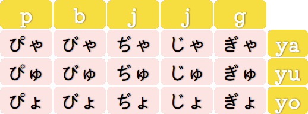

[Voltar ao README 🡑](../README.md)

[« Capítulo anterior](lição02.md)

# **Mais sobre os kana**
O ***hiragana*** e o ***katakana*** formam um conjunto chamado ***kana***.
O que aprendemos nos dois primeiros capítulos foi apenas o básico, pois apenas com aquelas duas tabelas, como a gente faz pra escrever uma coluna para o **d**, para o **g**, para o **z** ou para mais algumas outras consoantes que temos no português? Isso significa que no japonês não tem eles? Não, e em cada um dos tópicos a seguir será um ponto que nos falta para completar os requisitos para lermos tudo de ***hiragana*** e ***katakana***.

- [**Mais sobre os kana**](#mais-sobre-os-kana)
	- [**Sons vozeados e sons surdos**](#sons-vozeados-e-sons-surdos)
	- [**Seion (清音)**](#seion-清音)
	- [**Dakuon (濁音)**](#dakuon-濁音)
		- [**Os caracteres da coluna do k**](#os-caracteres-da-coluna-do-k)
		- [**Os caracteres da coluna do s**](#os-caracteres-da-coluna-do-s)
		- [**Os caracteres da coluna do t**](#os-caracteres-da-coluna-do-t)
		- [**Os caracteres da coluna do h**](#os-caracteres-da-coluna-do-h)
	- [**Handakuon (半濁音)**](#handakuon-半濁音)
	- [**Youon (拗音)**](#youon-拗音)
	- [**Chouon (長音)**](#chouon-長音)
	- [**Sokuon (促音)**](#sokuon-促音)

## **Sons vozeados e sons surdos**
As duas tabelas de caracteres apresentadas nos dois capítulos anteriores representam apenas os sons naturais/puros no idioma japonês, e diferente do português que existem também esses sons, não nos é ensinado que isso existe, apenas aprendemos as letras e os sons associados a cada uma sem explicação de como realmente funciona.

Entrando mais uma vez em um ponto que tange fonética e fonologia, podemos falar de forma simplificada que ao me referir a “sons naturais”, quero dizer sons não vozeados.
E o que é isso? Sons não vozeados são os que não geram vibração nas cordas vocais.
Mas todos os sons não produzem vibrações nas cordas vocais? E se não produzem, como eu posso saber quais sons produzem vibrações nelas? Nem todos os sons produzem vibração nas cordas vocais.
Para descobrir, basta você segurar seu próprio pescoço e tentar falar qualquer palavra, então você vai perceber que seu pescoço começa a ter uma leve vibração, e pra comparar sons com vibração e sem vibração alterne entre falar continuamente o som apenas de **s** e o som apenas de **z**.

Pergunta:
> Eu tentei falar meu nome, ele tem **s** e consegui sentir vibração também, então o que tu disse não faz sentido!
 
Isso se dá devido a maioria dos fonemas vocálicos serem vozeados, portanto, ao pronunciar o som de **s** acompanhando de uma vogal, normalmente produz uma sílaba que parece ser totalmente vozeada.
Entretanto, existe uma forma simples de transformar um som vozeado em um som surdo – sons não vozeados também podem ser chamados de sons surdos –, basta falar a palavra desejada ao sussurrar.

Agora façamos o mesmo processo de falar uma palavra com a mão no pescoço.
Ao alternar entra falar normalmente e falar ao sussurrar a palavra **sussurro**, que possui três letras s e 3 vogais, percebemos que não existe vibração ao sussurrar.

Após essa breve introdução podemos partir para os próximos tópicos do capítulo.

## **Seion (清音)**
As tabelas de caracteres apresentadas nos dois capítulos anteriores são basicamente os sons surdos existentes na língua japonesa mais alguns vozeados que não possuem surda.
Em japonês, os sons dessa tabela são chamados de seion.

## **Dakuon (濁音)**
Esse é o primeiro tópico para introduzir mais detalhes de como ler ***hiragana*** e ***katakana***.
Dakuon são as versões vozeadas de alguns dos caracteres da tabela básica.
São eles os caracteres da coluna do **k**, do **s**, do **t** e do **h**.
Para indicar a mudança da pronúncia dos caracteres, adicionamos uma figura tipográfica chamada dakuten imediatamente após o caractere, por exemplo, o ***kana*** か com esse símbolo vira が.
Isso serve tanto para o ***katakana*** quanto para o ***hiragana***.

### **Os caracteres da coluna do k**
A mudança sonora da coluna do **k** muda o som para **g**, ficando da seguinte forma:

か→が | き→ぎ | く→ぐ | け→げ| こ→ご
|:-:|:-:|:-:|:-:|:-:|
カ→ガ | キ→ギ | ク→ゲ |ケ→ゲ | コ→ゴ

A escrita fonética é [ga], [gi], [gɯ], [ge] e [go].
Então:
- O som para か e カ é [ka], o som para が e ガ é [ga];
- O som para き e キ é [ki], o som para ぎ e ギ é [gi];
- O som para く e ク é [kɯ], o som para ぐ e グ é [gɯ];
- O som para け e ケ é [ke], o som para げ e ゲ é [ge];
- O som para こ e コ é [ko], o som para ご e ゴ é [go].

A romanização é **ga**, **gi**, **gu**, **ge** e **go**, respectivamente.

> **Observações**:
> 1. Nos caracteres ぎ e げ – assim como ギ e ゲ –, a pronúncia não é como no **ge** da palavra gengibre e no **gi** da palavra **ginástica**, mas sim como **gue** da palavra guerra e **gui** da palavra guitarra;
> 2. A posição da língua e formato da boca em [k] e [g] é a mesma, a única diferença é que [k] é surdo e [g] é vozeado.

### **Os caracteres da coluna do s**
A alteração sonora da coluna do s muda o s para z, com exceção じ.
Assim como o som esperado deveria ser [s] mas é de [ɕ], o som do [zi] é [ʑi].
O som é bastante semelhante ao nosso j, mas para fazê-lo, a posição da língua fica entre o início palato duro – vulgo céu da boca – e os dentes, ou seja, um pouco acima dos dentes.
Então:
- O som para さ e サ é [sa], o som para ざ e ザ é [za];
- O som para し e シ é [ɕi], o som para じ e ジ é [ʑi];
- O som para す e ス é [sɯ], o som para ず e ズ é [zɯ];
- O som para せ e セ é [se], o som para ぜ e ゼ é [ze];
- O som para そ e ソ é [so], o som para ぞ e ゾ é [zo].

A romanização é **za**, **ji**, **zu**, **ze** e **zo**, respectivamente.

### **Os caracteres da coluna do t**
Na coluna do t, a mudança sono ocorre de [t] para [d] – exatamente o mesmo do nosso português –, com exceção de ぢ e づ.
Então:
- O som para た e タ é [ta], o som para だ e ダ é [da];
- O som para ち e チ é [tɕi], o som para ぢ e ヂ é [ʑi];
- O som para つ e ツ é [tsɯ], o som para づ e ヅ é [zɯ];
- O som para て e テ é [te], o som para で e デ é [de];
- O som para と e ト é [to], o som para ど e ド é [do].

A romanização é **da**, **ji**, **dzu**/**zu**, **de** e **do**, respectivamente.

> **Observações**:
> 1. A posição da língua nos seguintes pares é a mesma, a única diferença é que o primeiro do par é surdo e o segundo é vozeado: [s] e [z]; [ɕ] e [ʑ]; [t] e [d];
> 2. O som de じ, ジ, ぢ e ヂ é o mesmo, assim como ず, ズ, づ e ヅ também é o mesmo.

### **Os caracteres da coluna do h**
Para esta coluna é um pouco diferente.
Ao adicionar o ***dakuten*** aos caracteres desta coluna, o som não fica vozeado, apenas muda para [b].
Então:
- O som para は e ハ é [ha], o som para ば e バ é [ba];
- O som para ひ e ヒ é [çi], o som para び e ビ é [bi];
- O som para ふ e フ é [ɸɯ], o som para ぶ e ブ é [bɯ];
- O som para へ e ヘ é [he], o som para べ e ベ é [be];
- O som para ほ e ホ é [ho], o som para ぼ e ボ é [bo].

A romanização é **ba**, **bi**, **bu**, **be** e **bo**, respectivamente.

## **Handakuon (半濁音)**
Como o nome sugere, o ***handakuon*** é bem parecido com o ***dakuon*** e ocorre apenas na coluna do **h**. A mudança ocorre para [p] e não [b]. O símbolo, em vez de colocar o ***dakuten***, é um círculo pequeno na mesma posição. Então:
- O som para ぱ e パ é [pa];
- O som para ぴ e ピ é [pi];
- O som para ぷ e プ é [pɯ];
- O som para ぺ e ペ é [pe];
- O som para ぽ e ポ é [po].

A romanização é **pa**, **pi**, **pu**, **pe** e **po**, respectivamente.

## **Youon (拗音)**
Após ver as duas figuras tipográficas que modificam os sons naturais de algumas colunas das tabelas de caracteres, a partir deste tópico, veremos mais algumas peculiaridades da língua japonesa mas que utilizam apenas os caracteres que já conhecemos, mas com uma organização levemente diferente.
Sempre com base na posição da tabela do ***katakana*** e do ***hiragana*** no formato de escrita padrão dos capítulos 1 e 2, graficamente, o ***youon*** é a utilização dos caracteres da いだん juntamente a um や, ゆ ou よ em tamanho reduzido.

Os caracteres da いだんcom a coluna do **k**, ou seja, o き, então essa junção ficaria きゃ, きゅ, きょ com a escrita fonética [kja], [kju], [kjo].
Esse **j** representa um fenômeno chamado germinação, que indica que posição da língua fica na posição de dizer **i** e ao dizê-lo é bem curto.
A duração do tempo de pronúncia de um [kja] é mesma que um [ka].

Devemos perceber que para pegar a pronúncia da forma realmente correta, é precisamos entender o que é a mora.
Mora é uma unidade de tempo de fala que é usada na língua japonesa para medir a duração de cada sílaba.
É geralmente definida como a quantidade de tempo necessária para pronunciar uma vogal simples – como em あ, い, う, え e お –, a junção de uma consoante com uma vogal – como em か, き, く, け e こ –, ou no caso do ん, que o tempo para pronunciá-lo também é a duração de uma mora.

Caso não tenha ficado claro depois desta explicação, o tempo de duração de cada uma das sílabas no japonês é aproximadamente o mesmo, diferente do nosso português que geralmente alongamos a duração da sílaba tônica, como na própria palavra **tônica**, que pra no japonês a pronúncia ficar parecida com a nossa, seria escrito algo como とおにか.

Em comparação, か dura uma mora, きゃ uma também e きや duas, então essas três coisas diferentes, não os confunda.
E para resumir e exemplificar a transcrição fonética de alguns ***youon*** são:
- きゃ, きゅ e きょ são respectivamente [kja], [kjɯ] e [kjo];
- しゃ, しゅ e しょ são respectivamente [ɕa], [ɕɯ] e [ɕo];
- ちゃ, ちゅ e ちょ são respectivamente [tɕa], [tɕɯ] e [tɕo];
- にゃ, にゅ e にょ são respectivamente [nja], [njɯ] e [njo];
- ひゃ, ひゅ e ひょ são respectivamente [ça], [çɯ] e [ço]3;
- みゃ, みゅ e みょ são respectivamente [mja], [mjɯ] e [mjo];
- りゃ, りゅ e りょ são respectivamente [ɾja], [ɾjɯ] e [ɾjo].

>Observações:
>
> 1. Mesmo que os caracteres sejam só os que estão na tabela, também é possível utilizar os caracteres com ***dakuon*** e ***handakuon***, como びゃ, びゅ, びょ, ぴゃ, ぴゅ e ぴょ, lembre apenas que o primeiro caractere deve ser da いだん.
> 2. Apesar de não mostrar nos exemplos, todas as combinações funcionam para o ***katakana*** também, lembre apenas de colocar os  ヤ, ユ e ヨ pequenos, assim como em ニャ, ニュ e ニョ.
> 3. Apenas os ***youon*** com [ɕ], [ç] e [ɲ] não existe o símbolo j pois naturalmente fazemos este som como se fosse uma germinação.

As próximas tabelas mostram todos os ***youon***:

A romanização depende da consoante inicial, por exemplo, para きゃ, きゅ e きょ é romanizado como **kya**, **kyu** e **kyo**, respectivamente.
Essa lógica funciona até para ***dakuon*** e ***handakuon***, exceto com し, じ, ち e ぢ, pois com eles fica da seguinte forma:
- しゃ, しゅ e しょ, respectivamente **sha**, **shu** e **sho**;
- じゃ, じゅ e じょ, respectivamente **ja**, **ju** e **jo**;
- ちゃ, ちゅ e ちょ, respectivamente **cha**, **chu** e **cho**;
- ぢゃ, ぢゅ e ぢょ, respectivamente **ja**, **ju** e **jo**.

## **Chouon (長音)**
Este tópico é bem simples.
O ***chouon*** apenas indica o prolongamento da vogal da sílaba anterior, como na palavra fictícia とおにか que o お prolonga o som do **o** em と.
Outra palavra que isso ocorre é おかあさん, que a pronúncia é “okaasan”, não algo como “oka asan” como se houvesse uma pausa entre as duas letras **a**s seguidas, é contínuo e sem pausa.
O símbolo do prolongamento na transcrição fonética é o sinal de dois pontos, [:].
Palavras em que isso ocorre:
- Com あ: おかあさん, ラーメン;
- Com い: おじいさん, おにいさん;
- Com う: すうじ, ユーチューブ;
- Com え: おねえさん, ケーキ;
- Com お: おおき, こおり, おおかみ.

Em ***katakana***, a indicação de prolongamento de mesma vogal é feita com um traço na direção da escrita, diferente do hiragana que ocorre a escrita da vogal que continua o som.
As palavras são: ラーメン, que é lámen; ユーチューブ, que é  YouTube; e ケーキ, que é biscoito (vindo do inglês, cake, “keeki”).
Existem mais dois casos de prolongamento:
- O い escrito após um caractere da えだん prolonga o som do **e**, assim como na palavra えいが, [e:ga], que significa filme;
- O う escrito após um caractere da おだん prolonga o som do **o**, assim como na palavra とうきょう, [to:kjo:], que significa Tóquio.

Esses casos são uma verdadeira pegadinha, pois apesar de na grande maioria sempre acontecerem, existem palavras que seguem esses padrões mas não há o prolongamento da vogal, como na palavra めい, [mei], que significa sobrinha e おもう, [omoɯ] e não [omo:], que significa pensar.
No segundo caso, a maioria das vezes que isso ocorre é pela palavra ser um verbo, e em alguns outros casos ocorre quando a palavra é uma junção de outras duas, uma que a primeira termina com [o] e outra que a segunda começa com [ɯ].

## **Sokuon (促音)**
O último ponto sobre as peculiaridades para leitura e escrita do idioma japonês é o ***sokuon***.
Algumas definições sugerem que ele é um prolongamento com a duração de uma mora do som das consoantes, já outras indicam que ele é uma pausa com a duração de uma mora.

Tecnicamente falando, a definição correta é a do prolongamento, mas é entendível algumas pessoas definirem como pausa.
Em sons de consoantes como [t], não existe uma forma de prolongar a produção de tal som, mas em sons de consoantes como [s] existe essa possibilidade, enquanto há fôlego, é possível fazer tal som.
Então, em casos que é possível prolongar o som, o correto é aumentar a duração em uma mora, e em casos que não é possível, o correto é posicionar a boca e a língua como se fosse falar a letra, mas fazer uma pausa sonora com a duração de uma mora.

O símbolo para transcrição fonética, assim como no ***chouon***, é [:] logo após a consoante e sua representação através da romanização é repetir a consoante que inicia o caractere imediatamente seguinte, por exemplo がっこう fica gakkou, ざっし fica zasshi.
Alguns exemplos de como fica a transcrição fonética:
- サッカー, [sak:a:], significa futebol;
- いっしょ, [iɕ:o], significa juntos;
- がっこう, [gak:o:], significa escola;
- ざっし, [zaɕ:i], significa revista.

Para exemplificar a forma correta, imagine que cada um dos quadrados das tabelas a seguir têm a mesma duração e que as células vazias representam silêncios:

1. Correto:

	Mora|1|2|3|4
	:-:|:-:|:-:|:-:|:-:
	**Transcrição** |[sa]|[ka]|[a]

	Incorreto:

	Mora|1|2|3
	:-:|:-:|:-:|:-:
	**Transcrição** |[sa]|[ka]|[a]

2. Correto:

	Mora|1|2|3
	:-:|:-:|:-:|:-:
	**Transcrição** |[i]|[ɕ]|[ɕo]

	Incorreto:

	Mora|1|2
	:-:|:-:|:-:
	**Transcrição** |[i]|[ɕo]

3. Correto:

	Mora|1|2|3|4
	:-:|:-:|:-:|:-:|:-:
	**Transcrição** |[ga]||[ko]|[o]

	Incorreto:

	Mora|1|2|3
	:-:|:-:|:-:|:-:
	**Transcrição** |[ga]|[ko]|[o]

4. Correto:

	Mora|1|2|3
	:-:|:-:|:-:|:-:
	**Transcrição** |[za]|[ɕ]|[ɕi]

	Incorreto:

	Mora|1|2
	:-:|:-:|:-:
	**Transcrição** |[za]|[ɕi]

[« Capítulo anterior](lição02.md)

[Voltar ao README 🡑](../README.md)
