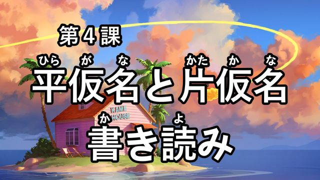
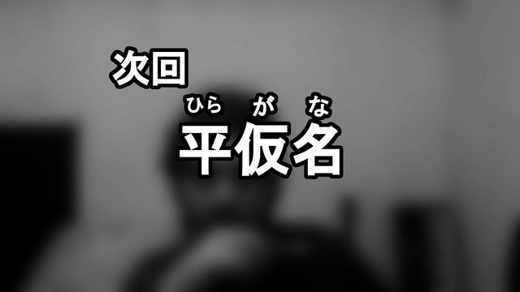

[Voltar ao README 🡑](../README.md)

[« Capítulo anterior](lição03.md)

# **Kanji**

Passamos pelos dois silabários japoneses e seus macetes para leitura e escrita. Agora introduziremos um dos maiores desafios da língua japonesa, os ***kanji***.
Assim como nos capítulos de ***hiragana*** e ***katakana***, passaremos primeiro pela sua contextualização histórica e logo em seguida algumas definições necessárias.
Então, sem mais delongas, vamos a diante.

- [**Kanji**](#kanji)
	- [**Contextualização histórica**](#contextualização-histórica)
	- [**Leituras e classificações de caracteres dos kanji**](#leituras-e-classificações-de-caracteres-dos-kanji)
		- [**On’yomi (音読み)**](#onyomi-音読み)
		- [**Kun’yomi (訓読み)**](#kunyomi-訓読み)
		- [**Furigana (振り仮名)**](#furigana-振り仮名)
		- [**Okurigana (送り仮名)**](#okurigana-送り仮名)
	- [**Como saber qual leitura usar?**](#como-saber-qual-leitura-usar)

## **Contextualização histórica**
O idioma japonês demorou bastante para possuir um sistema de escrita.
Após entrar em contato com a China, o Japão reconheceu que os chineses eram um povo com tecnologias interessantes e bastante desenvolvidas.
Com o passar do tempo, várias de suas ideias, tecnologias e histórias foram compartilhadas e o sistema de escrita não poderia ficar de fora, e nos primeiros séculos após os primeiros contatos, o Japão era praticamente um espelho da China.
Depois de algumas viagens, monges budistas importaram os caracteres chineses para poderem escrever, mas como muitos desses símbolos eram rebuscados e com traçado complexo, inicialmente simplificaram para disseminar a escrita com mais rapidez.

A diferença entre os idiomas era bem considerável para que ocorresse apenas uma adaptação sem fazer algumas alterações.
Devido as limitações fonéticas em comparação da língua falada japonesa e chinesa, alguns ***kanji*** foram mais aceitos pelos seus valores fonéticos atualmente conhecidos por ***hentaigana***.
Após essa convergência de uso, ocorreu a simplificação de alguns destes ***kanji*** que geraram o que hoje conhecemos como ***katakana*** e ***hiragana***.

Por existir vários sistemas de escrita, pessoas diferentes escolhiam sistemas de escrita diferente; não havia padronização ou unificação de como escrever.
No entanto, uma coisa era certa: não era possível se livrar dos ***kanji***, já que havia cerca de 5.000 a 10.000 deles importados que ajudava na leitura. A falta de espaços entre as palavras era algo natural.

A dificuldade de escrita do japonês sempre foi tema de debate.
Em alguns desses debates, chegaram a propor que o sistema mudasse para ***roomaji***, o alfabeto que a maioria do ocidente usa.
No entanto, essa ideia caiu por terra muito rápido devido às peculiaridades da língua.

Em 1900, vendo que era terra sem lei em relação a escrita, o Ministério da Educação sugeriu três reformas para melhorar o sistema educacional do país:
1. Padronização do silabário ***hiragana***, eliminando assim o sistema ***hentaigana***, até então em uso;
2. Restrição do número de ***kanji*** ensinados no ensino fundamental (aproximadamente 1200 caracteres);
3. Reforma da irregular representação por meio do ***kana*** das leituras ***on*** dos ***kanji***, para estarem em conformidade com a pronúncia, retratado de um dos tópicos do último capítulo, o uso histórico dos ***kana***.

Dentre essas três propostas, o conservadorismo japonês impediu que a terceira entrasse em vigor, justificando que “isso mudaria nossa tradição”.
Vários conservadores no poder se opuseram a essa reforma.
No entanto, os próprios jornais restringiram voluntariamente o uso dos ***kanji*** e colocaram mais ***furigana*** – será explicado em um tópico posterior – o que causou certa agitação entre aqueles que eram contra essa medida.

Após a tragédia contra os japoneses e sua derrota na **Segunda Guerra Mundial**, aconteceu a remoção dos conservadores do controle do sistema educacional e todas as tentativas de reformas paralisadas desde a primeira, em 1900, voltaram a entrar em debate.
As propostas que ganharam mais destaque e aprovação foram:
1. O alinhamento do uso do ***kana*** com a pronúncia moderna;
2. A promulgação da ***touyou kanji*** (当用漢字), lista com 1850 ideogramas, que, teoricamente, todos deveriam saber até o fim da escola primária – equivalente ao nosso 6º ano do ensino fundamental em 2023;
3. A simplificação de alguns ***kanji***, que posteriormente receberam o nome de ***shinjitai*** (新字体), que por consequência fez o anterior conjunto de caracteres ser conhecido por ***kyuujitai*** (旧字体);
4. A promulgação da ***jinmeiyou kanji*** (人名用漢字), lista composta que em conjunto com o ***touyou kanji*** podiam ser usados para nomes próprios.
No total, compreende cerca de 2000 ideogramas e tem sido atualizada ao longo dos anos pelo Ministério da Educação.

Antes dessa grande reforma, a direção padrão da escrita era de cima para baixo, da direita para a esquerda.
Mesmo após a implementação reforma, por algum tempo ainda havia locais que utilizavam a escrita padrão.
Atualmente é bastante raro, sendo os nomes das estações de trem em placas de identificação uma das últimas coisas que foram alteradas.

Em 1981, o governo expandiu a ***touyou kanji*** de 1850 para 1945, então conhecidos como ***joyou kanji hyo*** (常用漢字表).
Nessa atualização também adicionaram mais 166 separadamente e especificamente para nomes.
Em 2010, foram removidos 5 ideogramas da ***joyou kanji hyo*** e adicionados mais 196, totalizando 2136 ***kanji***.
Esta nova lista se chama ***joyou kanji*** (常用漢字) e é usada até os dias atuais.

Publicações não especializadas como jornais, livros, documentos do governo e outras utilizam somente esses ideogramas.
Escritores de outros materiais são livres para usar qualquer outro que queiram.

Um dos pontos que ganharam destaque foram os ***kyouiku kanji*** (教育漢字) – significa literalmente ***kanji*** educacionais –, uma sublista dos primeiros 1006 ideogramas aprendidos da ***joyou kanji*** que as escolas ensinam até o sexto ano.
O Ministério da Educação decidiu uma ordem de aprendizagem desses ***kanji***, sendo assim, durante os seis anos da escola primária, todos aprendem os primeiros 1006 ideogramas e na mesma ordem:
- No 1º ano são 80;
- No 2º ano são 160;
- No 3º ano são 200;
- No 4º ano são 200;
- No 5º ano são 185; e
- No 6º ano são 181.

Em 2020, essa lista aumentou em mais 20 ***kanji***, contudo, estes são dedicados aos nomes das províncias principais.
Após a escola primária, as escolas não ensinam mais o restante dos ideogramas, entretanto, espera-se que todos os alunos aprendam a ***joyou kanji*** completa até o final do ensino médio.

## **Leituras e classificações de caracteres dos kanji**
Podemos pensar que cada ideograma possui apenas uma leitura possível, mas existem várias, e basicamente se dividem em dois tipos, a ***on’yomi*** e a ***kun’yomi***.

> **Observação**:
> Os nomes ***on’yomi*** e ***kun’yomi*** possuem apóstrofos para indicar que o correto não é junto, a pronúncia seria algo como ***õyomi*** e ***kũyomi***.

A importação dos ***kanji*** não aconteceu de formas isolada, às vezes eram em grupos, em épocas e de locais diferentes, gerando assim um grande desafio para saber qual a pronúncia certa. Se considerarmos que a do Brasil varia consideravelmente de um estado para o outro, podemos imaginar que na China, com seus tons de fala, seja algo bem maior.

### **On’yomi (音読み)**
A ***on’yomi*** – literalmente leitura do som – é relacionada ao som da leitura chinesa do caractere.
Ela indica como os japoneses entendiam a pronúncia dos chineses.
O idioma chinês é uma linguagem tonal, isso quer dizer que uma mesma palavra significa coisas completamente diferentes dependendo da entonação do comunicador, somado a diversidade de sons consonantais relativamente parecidos, gera um conjunto grande de combinações possíveis.

No entanto, devido as limitações fonéticas da língua japonesa em relação a pronúncia chinesa, a quantidade e combinações a serem faladas é restringida, o que pode dar a impressão de que facilita todo o trabalho, mas não é bem assim.
A on’yomi é dividida em 4 tipos:
1. ***Goon*** (呉音): leituras provenientes da região ***Wu*** durante os séculos V-VI, hoje está nas proximidades da moderna ***Shangai***;
2. ***Kaon*** (漢音): são leituras provenientes da Dinastia ***Tang*** nos séculos VII-IX, principalmente da fala padrão da capital, ***Chang'an***;
3. ***Touon*** (唐音): são leituras provenientes da pronúncia de dinastias posteriores, como as dinastias *Song* e *Ming*; abrangem todas as leituras adotadas a partir da era *Heian* ao período *Edo*. Também é conhecida como ***tousou'on***;
4. **Kan’youon** (慣用音): essas são leituras que não correspondem às regras de pronúncia, ou erradas que passaram a ser aceitas.

### **Kun’yomi (訓読み)**
***Kun’yomi*** significa leitura nacional.
Embora seja natural pensar que existe apenas uma leitura nacional para cada ideograma, até mesmo na nossa língua existem várias palavras para representar a mesma ideia. Como resultado, não é estranho se pensar que exista mais de uma ***kun’yomi*** para cada ***kanji*** na língua japonesa.

Por exemplo, a palavra portuguesa para definir o objeto “ciscador”, em outros lugares pelo Brasil, tem o nome de **rastelo** e até de **ancinho**.
Outra situação que isso acontece é com a gruta tangeria. Em alguns lugares chama mexerica e alguns outros chamam de bergamota – o que na minha opinião, é um nome muito feio.

Essa leitura também possui uma pequena divisão que será mostrada nos próximos subtópicos.
- ***Kokuji*** (国字): sabemos que os ***kanji*** vierem da China, mas os japoneses também criaram alguns em cima dos que eles importaram. Estes são chamados de ***kokuji***, que significa literalmente ***kanji*** nacionais. Entre eles estão nas palavras:
	- 饂 (うどん) que é um tipo de **macarrão**;
	- 畑 (はたけ) que é **campo de cultivo**;
	- 働く (はたらく) que significa **trabalhar**;
	- 匂 (におい) que significa **cheiro**.

> **Observações**:
> 1. Muito provavelmente é o mesmo sobrenome do Kakashi de Naruto, e かかし por si só significa espantalho, então o nome desse personagem significa algo como “espantalho do campo de cultivo”.
> 
> 2. Na China não existia a palavra para “trabalhar”, então, aparentemente, após o Japão criar este kanji, a China o importou para usá-lo com a mesma finalidade.

- ***Ateji*** (当て字): outra peculiaridade é que existem ideogramas definidos como ateji, que são uma composição de ***kanji*** que possui valor apenas fonético. Exemplos de palavras que possuem esse tipo de composição:
	- 寿司 (すし): que significa **sushi**. O uso mais comum é すし, em ***hiragana*** mesmo. Os respectivos significados dos ***kanji*** são **longevidade** e **administrar**;
	- 拉麺 (ラーメン): que é **lámen**. O uso mais comum em japonês é ラーメン, em katakana. Os respectivos significados dos ***kanji*** são para **latin** e **macarrão**;
	- 珈琲(コーヒー): que é **café**. O uso mais comum em japonês é コーヒー, também em ***katakana***. Os respectivos significados dos kanji são **cordão de muitas pérolas** e **grampos de cabelo ornamentais**.
- ***Kokkun*** (国訓): são os kanji que a definição deles é que a leitura nativa não possui relação com o significado em chinês, por exemplo:

||||
:-:|:-:|:-:
|| **Japonês** | **Chinês**
沖 (おき) | mar aberto | enxaguar / rio menor
鮎 (あゆ) | glicínia | videira
椿 (つばき) | camélia japônica | ailanthus
手紙 (てがみ) | carta | papel higiênico

### **Furigana (振り仮名)**
O furigana nada mais é do que o kana exibido acima ou próximo de um ***kanji*** para indicar a pronúncia, como nas imagens de intro e de preview do tema do próximo vídeo do canal:

### **Okurigana (送り仮名)**
Alguns ***kanji*** possuem leitura isoladamente, outros precisam do auxílio de alguns ***kana*** escritos para completar a leitura da palavra.
Esses ***kana*** são chamados de ***okurigana***. Alguns deles podem ser usados para identificar até a classe gramatical da palavra, mas isso não é totalmente uma regra. Os ***kanji*** da segunda linha da imagem da direita anterior tem 書き読み.
O き é o okurigana de 書 e み é o okurigana de 読4.
Esses são mais alguns exemplos:
- 安い (やすい), que significa barato, tem okurigana い;
- 忙しい (いそがしい), que significa **ocupado**, tem ***okurigana*** しい;
- 来る (くる), que é o verbo **vir**, tem ***okurigana*** る;
- 売る (うる), que é o verbo **vender**, tem ***okurigana*** る;
- 呼ぶ (よぶ), que é o verbo **chamar**, tem ***okurigana*** ぶ.

> **Observação**:
> Na parte superior da imagem da direita, o と não é o ***okurigana*** de 平仮名 pois ela já tem o sentido completo somente com seus ***kanji***.

## **Como saber qual leitura usar?**
Alguns ***kanji*** possuem mais de uma ***on’yomi*** e ***kun’yomi***, o que resulta em várias combinações possíveis.
Para responder como saber qual das leituras existentes devemos usar a lógica: não existe lógica, mas tem algumas dicas e macetes básicos.

Entretanto, devemos entender que mesmo com dicas, não tem como acertar todos os casos.
Os ***kanji*** vieram de época, lugar e alguns nem correspondem mais as pronuncias naturais, e sendo assim, o mais correto é realmente conhecer a palavra para saber sua real pronúncia.

Temos que levar em consideração também que é mais fácil entender o significado de um conjunto de ***kanji*** pelo significado individualmente de cada um deles que saber sua pronúncia sem conhecer a palavra antes.
Por exemplo, 牛 significa boi, 乳 significa leite e 肉 significa carne, então podemos supor que o significado de 牛肉 seja **leite bovino** e de 牛肉 seja **carne bovina**.

Vamos para duas dicas gerais:
1. Em palavras somente com um ***kanji*** ou que possuam ***okurigana***, a chance da pronúncia ser ***kun'yomi*** é extremamente alta;
2. Em palavras que possuam dois ou mais ***kanji***, a chance da pronúncia ser ***on'yomi*** é extremamente alta.

Se formos um pouco mais críticos, isso não ajuda muito devido a vários ***kanji*** terem mais de uma leitura ***on*** ou ***kun***, apenas limita o escopo de procura.
Em comparação com o português, japonês tem pouquíssimas exceções, mas essas duas dicas possuem tantas exceções que em comparação com outras, não dá nem para chamar de regra direito.

Nem tudo está perdido, os seguintes tópicos relacionam mais alguns tipos de leituras que podem servir como dicas, então, basta continuarmos para adicionar um pouco de luz a nossa dúvida.

[« Capítulo anterior](lição03.md)

[Voltar ao README 🡑](../README.md)
