[Voltar ao README 🡑](../README.md)

[« Capítulo anterior](lição04.md) |
[Próximo capítulo »](lição06.md)

# **Lição 05: Estudando kanji**
O que devemos ter em mente agora é que para entendermos realmente o japonês, contra ou a favor da nossa vontade, devemos saber vários ***`kanji`***, mas uma das formas mais comuns de estudantes começarem é estudá-los pela ordem que os japoneses viram na escola, ou seja, a ***`kyouiku kanji`***, a lista ensinada do 1º ao 6º ano do primário.
Isso não é uma boa forma de gastar seu esforço.
Neste capítulo aprenderemos melhores formas de estudarmos os tão temidos ***`kanji`***.

- [**Lição 05: Estudando kanji**](#lição-05-estudando-kanji)
	- [**Por onde começar?**](#por-onde-começar)
	- [**Escrever a mão**](#escrever-a-mão)
	- [**O Anki**](#o-anki)
	- [**Não aprenda por kanji isolados**](#não-aprenda-por-kanji-isolados)
	- [**Teclado em japonês no Windows 10**](#teclado-em-japonês-no-windows-10)
		- [**Instalando o teclado**](#instalando-o-teclado)
		- [**Utilizando o teclado**](#utilizando-o-teclado)
		- [**Algumas dicas para digitar**](#algumas-dicas-para-digitar)
	- [**Teclado em japonês no dispositivo Android**](#teclado-em-japonês-no-dispositivo-android)
		- [**Configurando o teclado japonês**](#configurando-o-teclado-japonês)
	- [**Segredos de digitação**](#segredos-de-digitação)
	- [**Notas finais**](#notas-finais)

## **Por onde começar?**
Ao entrar na escola, as crianças japonesas já sabem ler e escrever tanto ***`hiragana`*** quanto ***`katakana`***.
O raciocínio dos estudantes de japonês é então seguir os mesmos passos dos japoneses após entrar na escola: aprender os ***`kyouiku kanji`*** na ordem estudada na escola.
Isso é um dos erros mais complicados de se perceber logo de cara.

Devemos levar em consideração que o contexto ao qual uma criança japonesa e o contexto ao qual nós estamos inseridos são completamente diferentes.
Elas já sabem  escrever os ***`kana`*** e falar japonês antes mesmo de entrar para a escola – mesmo que usem algumas construções de forma errada, mas eles já conseguem se comunicar –, logo, o processo delas é reconhecer de forma escrita o que elas já sabem falar.
Nós precisamos primeiro aprender a escrever, falar ainda não está em cogitação, pelo menos por um certo tempo.

Para compensar essa “deficiência”, o mais simples e efetivo é procurar formas de aprender coisas que faz nos sentir interessados e que nos introduza mesmo que de maneira superficial ao funcionamento da língua.
Um bom começo é utilizar algo que temos interesse para estudar os ***`kanji`*** em questão e altere os materiais sempre que você conseguirmos os entender com mais facilidade – não precisa ser completamente – e conseguir lembrar como eles são escritos.

Uma outra forma é ao trocar o texto foco de estudo, o seguinte texto esteja dentro do mesmo contexto do anterior para aproveitar a maior parte do vocabulário adquirido com o passar do tempo.
Com isso, aprendemos palavras novas ao passo que aproveitamos o vocabulário do texto anterior.
Trocar para textos com contextos diferentes, principalmente os que não sentimos interesse, é um esforço não necessário que pode levar a frustração.
Devemos reforçar o que aprendemos em vez de pular de conteúdo em conteúdo para começar todo o entendimento do zero em cada texto.

Para quem gosta de cozinhar, começar por receitas em japonês que sabemos fazer é uma ótima ideia.
Para quem gosta de algum esporte específico, procurar notícias sobre tal esporte é uma ótima ideia.
Para quem gosta de saber sobre famosos, procurar notícias sobre famosos também é uma ótima ideia.
Entretanto, devemos ser mais cauteloso no contato com alguns assuntos.

Apesar de parecerem divertidos e interessantes, eles podem possuir um grau de entendimento mais abstrato e até mesmo confusos por usar construções gramaticais não convencionais.
Músicas e animes/mangás são exemplos de leituras que devemos ter cuidado.

Se várias músicas são cheias de figuras de linguagem em português, em japonês não seria diferente.
Em animes/mangás, o modo de falar dos personagens podem aparecer desde o modo formal, o modo informal, o modo honorífico, algumas construções que só devem ser usadas com quem temos mais proximidade, algumas construções são propositalmente ríspidas e algumas são arrogantes.

Este tipo de mídia é legal para aprender, entretanto, não é recomendável mimetizar os modos de fala dos personagens ou imaginar que é o japonês padrão.
Podemos ser grosseiros com outrem mesmo sem termos consciência sobre isso.

## **Escrever a mão**
Escrever ***`kanji`*** manualmente é uma das maneiras mais eficazes de aprendê-los e internalizá-los rapidamente.
De fato, pesquisas e estudos em várias faixas etárias e localizações ao redor do mundo têm provado sua eficácia.
Algumas pessoas percebem que retêm mais informações ao escrever e isso complementa a memorização motora e visual com a escrita em canetas coloridas.

No entanto, falando pessoalmente, escrever nunca foi uma técnica eficaz para minha própria memorização.
Às vezes, eu até sentia que me atrapalhava e limitava, porque sou mais forte no lado visual.
O resultado após já estar escrito era bom, mas era entediante minha mão não acompanhava a velocidade do meu pensamento, levando a frustração e perda de interesse em vários assuntos na escola.

Quando os professores usavam materiais com mapas mentais já desenhados, eu conseguia absorver o conteúdo de forma rápida e efetiva.
Portanto, se escrever também o desencoraja, tenho uma maneira de ajudá-lo, porque entendo exatamente como é.
Mas não precisa se preocupar se você é o tipo de pessoa que seu ponto forte na memorização é escrever à mão pois a maneira a seguir vai ser bem proveitosa para você também

Existe uma fonte chamada ***`Kanji Stroke Order`*** e como o nome sugere, ela indica o traçado de cada ideograma levando em consideração a ordem do traçado.
Ela já foi utilizada neste mesmo guia, porém, no capítulo passado no tópico sobre a organização da ordem dos traços.
Veja novamente os ***`kanji`*** utilizados com a fonte ***`Kanji Stroke Order`***:

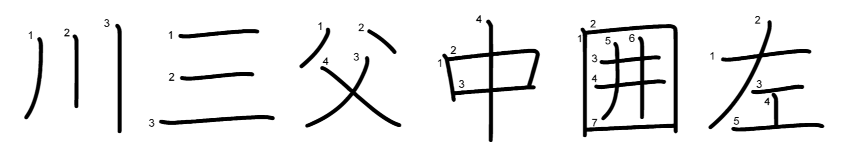

No começo, é realmente muito efetivo o estudo pela escrita manuscrita, mas assim que conseguir entendimento suficiente ou aprender as regras das ordens de traçado de forma mais concreta, está fonte é uma mão na roda para quem estuda.
Pode ser encontrada em [***Free Japanese Fonts***](https://www.freejapanesefont.com/kanji-stroke-order-font-download/).

Quanto mais o tempo passar no estudo de ***`kanji`*** utilizando essa fonte, mais vai ficar fácil perceber padrões e conseguir visualizar os radicais imediatamente após bater o olho em cada ideograma, até chegar o momento em que é possível saber a ordem do traçado na grande maioria dos casos mesmo sem utilizá-la.
Apenas mantenha o foco e continue, você vai conseguir.

## **O Anki**
Para aprendermos algo de forma plena, precisamos fixar o objeto de estudo na memória de longo prazo.
Para que uma informação seja armazenada na memória de longo prazo, precisamos processá-la na memória de curto prazo antes, através da atenção e concentração adequadas.

A memória de curto prazo é a capacidade do cérebro de manter informações por um curto período de tempo.
Essa memória é limitada em termos de capacidade e duração e pode ser facilmente esquecida se não for repetida ou praticada.

A chave para todo esse processo para fixação de algo na memória é repetição e o Anki é um aplicativo que utiliza princípios da memorização por repetição espaçada.
Repetição espaçada é uma técnica de estudo que envolve revisar o material de aprendizagem em intervalos de tempo crescentes.
Em outras palavras, em vez de revisar o material repetidamente em curtos intervalos de tempo, você revisa o material em intervalos maiores ao longo do tempo.

A repetição espaçada aproveita o fenômeno da curva do esquecimento – sua representação gráfica pode ser vista na figura abaixo.
A linha representa o quanto conseguimos reter a informação na memória.

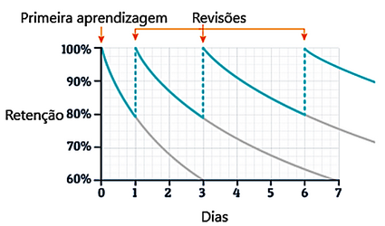

De forma bastante grosseira, um dia após entrar em contato com um conteúdo pela primeira vez, cerca de 80% dele continua de forma plena em nossa memória de curto prazo.
Ao fazer uma revisão após um dia, recuperamos praticamente toda a informação assimilada e de bônus diminuímos o decaimento da perda de informação, o que nos leva a precisar fazer repetições para relembrar o conteúdo em espaços cada vez maiores até chegar ao ponto de fixar na memória de longo prazo.

Agora falando sobre *flashcards*, eles são uma técnica popular de estudo devido à sua eficácia e simplicidade que são frequentemente usados por estudantes que precisam memorizar grandes quantidades de informações, como vocabulário em línguas estrangeiras, termos médicos ou leis, por exemplo.

Podem ser criados manualmente com cartões que na frente possui o conceito a ser estudado e no verso possui o significado.
Por exemplo, um cartão com frente escrito o ***`kanji`*** 犬 e no seu verso possui sua pronúncia e seu significado “いぬ – **`cachorro`**”.

A forma de utilizá-los é criar vários com os conceitos que queremos aprender e tentar acertar o verso.
Ao errarmos o verso, colocamos o cartão no final da pilha e continuamos com o próximo.
Ao acertarmos, colocamos em outra pilha para ser revisado em um momento posterior, normalmente no dia seguinte e continuamos a tentar acertar até termos apenas a pilha para revisão posterior.

O funcionamento do *Anki* é basicamente a junção dos conceitos de curva de esquecimento e *flashcards*.
A frente dos cartões aparece, você seleciona ou escreve a resposta e então pressiona a opção para mostrar a resposta.
Logo após, aparecerá mais opções na tela que são a dificuldade de acertar a resposta, assim como mostram as figuras abaixo.

	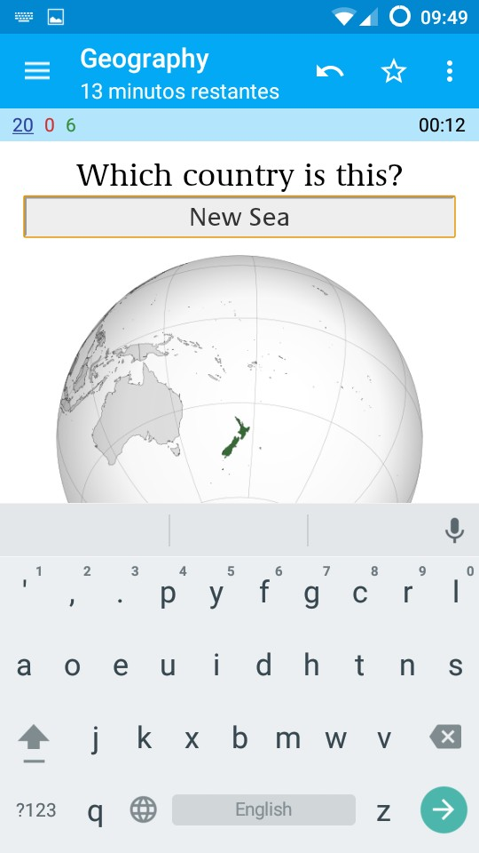
	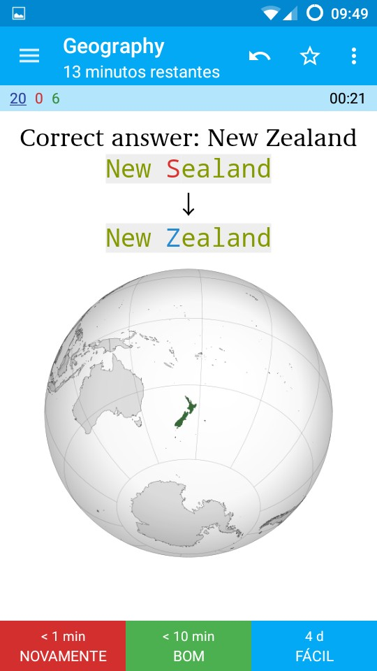
	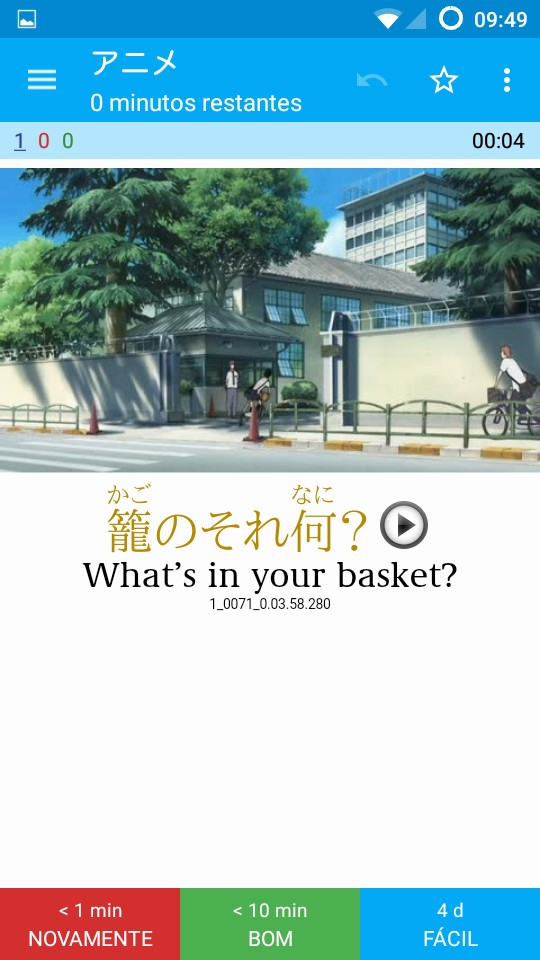

O próprio algoritmo do aplicativo se encarrega de calcular o próximo tempo de revisão de acordo com a opção escolhida de dificuldade da resposta.
O que precisamos fazer é apenas criar os baralhos e os cartões.
Para criá-los clicamos no ícone de adição e selecionamos a opção desejada e preenchemos os dados necessários.
As telas são as imagens seguintes:

	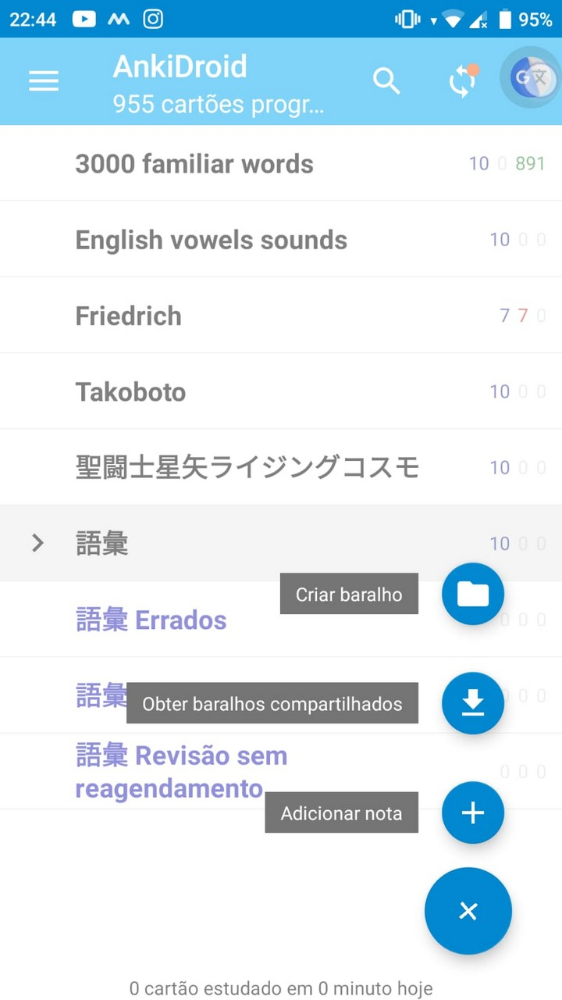
	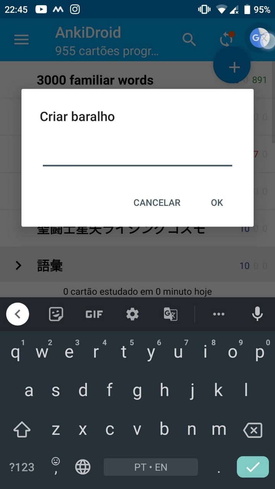
	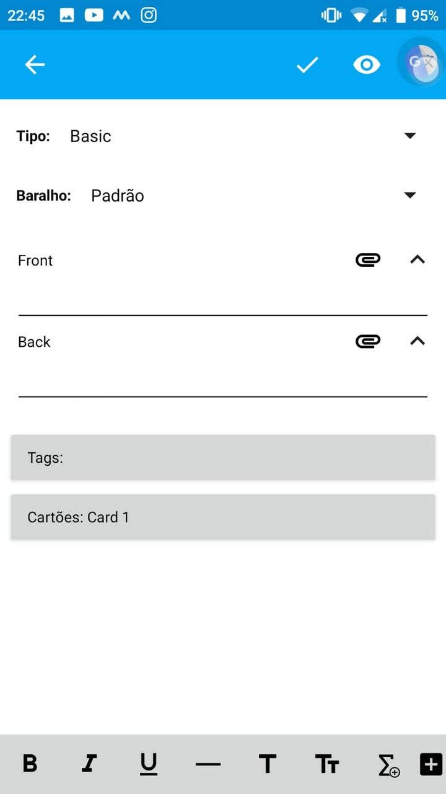

Podemos colocar vários tipos de dados nos cartões do *Anki*, então recomendo procurar informações do que podemos colocar em cada frente e verso do cartão – é possível colocar sons e imagens, além de vários tipos de dados, como campos para preencher a resposta correta.

Assim teremos uma grande ferramenta para ajudar na nossa memorização de vocabulário.
Entretanto, devemos levar em consideração que alocar muito tempo apenas nisso no começo não fará compreender o idioma.
O raciocínio “quantos mais palavras eu souber, menos vou precisar estudar gramática” é completamente falho.

O idioma japonês tem estrutura e organização completamente diferente do português.
Por incrível que pareça, apenas conhecer todas as palavras não nos faz capaz de entender o sentido/significado de cada frase.
Primeiro, o mais benéfico é buscar entender como é o funcionamento de forma geral do idioma e estudar frases dentro de um contexto, depois de compreendermos a base que devemos focar em vocabulário.
Isso não gerará desgaste, muito pelo contrário, o processo será bem mais divertido e natural.

## **Não aprenda por kanji isolados**
No tópico [**Escrever a mão**](#escrever-a-mão), destacamos que escrever manualmente é uma forma altamente eficaz de aprender ***`kanji`***.
No entanto, é importante lembrar que escrever à mão pode ser um processo demorado, já que cada ***`kanji`*** possui uma ordem específica de traçado que deve ser seguida.

Para contornar essa dificuldade, recomendamos o uso da fonte *Kanji Stroke Order*, que mostra a ordem correta dos traços.
Embora essa seja uma ótima dica para aprender a escrever kanji com a ordem correta, ainda pode levar algum tempo para memorizar todos os traços de cada ***`kanji`***.

Há uma frase em inglês popular que diz “*if you don’t use it, you lose it*”.
Isso também se aplica à escrita à mão dos ***`kanji`***, já que a comunicação digital tem reduzido a necessidade de escrevê-los. Se não praticarmos, podemos perder essa habilidade.

Devemos entender que isso não é um impeditivo para caso tenhamos vontade, apenas é uma coisa a ser considerada.
A melhor forma de manter a habilidade é praticando, então a prática contínua é ótima para não perdermos tal habilidade.

Um outro ponto que pode ser um gasto de energia sem um retorno equivalente é estudar apenas os ***`kanji`*** isoladamente e suas leituras – ***on’yomi*** e ***kun’yomi***.
Aprender cada uma delas é um trabalho demorado, são raros os ideogramas que possuem apenas uma leitura e algumas dos que possuem mais de uma são usadas só em casos bastantes específicos.

Uma forma interessante de aprendê-los é estudar por frases.
Ao memorizar palavras dentro do contexto, entendemos como usar a palavra e sua pronúncia, diferente de aprender cada uma das leituras para, no final, tentar adivinhar qual delas gera a real pronúncia da palavra.

Com o aumento do contato com a língua, percebemos que os ***`kanji`*** também podem ter sentidos diferentes em contextos diferentes.
Entretanto, isso é extremamente normal em cada idioma, não só no japonês.
Dito isto, ainda não conseguimos por esta dica em prática apenas com esta primeira unidade por ela tratar apenas dos aspectos escritos do japonês, mas a partir do próximo capítulo iniciamos a Unidade 2, que trata dos aspectos gramaticais básicos.

Nela terá a classe gramatical das palavras, como usá-las de forma geral e as especificidades da língua japonesa que não existem no português, como no caso das partículas.
Mas a explicação para cada uma dessas coisas será tópicos dos próximos capítulos, então continuem estudando! Não precisamos iniciar os estudos de ***`kanji`*** antes de conhecer o funcionamento básico da língua, portanto, é uma recomendação fazer isso apenas a partir do próximo capítulo.

Mas lembre-se de que não é uma obrigação seguir essa recomendação. Se você preferir, pode começar a estudar os kanji antes. O importante é continuar estudando para aprimorar seus conhecimentos.

## **Teclado em japonês no Windows 10**
Um motivo para justificar que aprender kanji apenas pela forma manuscrita seja um gasto de energia sem um retorno equivalente, é que cada vez menos escrevemos a mão com o avanço da tecnologia.
As formas de escrita praticamente se resumem a digitar no teclado.
Este tópico é para aprendermos a como escrever em japonês no *Windows* da forma mais simples possível.
De forma bem curta, precisamos apenas instalar a opção de teclado japonês.
### **Instalando o teclado**
Vamos aos seguintes passos:
1. Clique no botão iniciar do *Windows* e digite idioma;

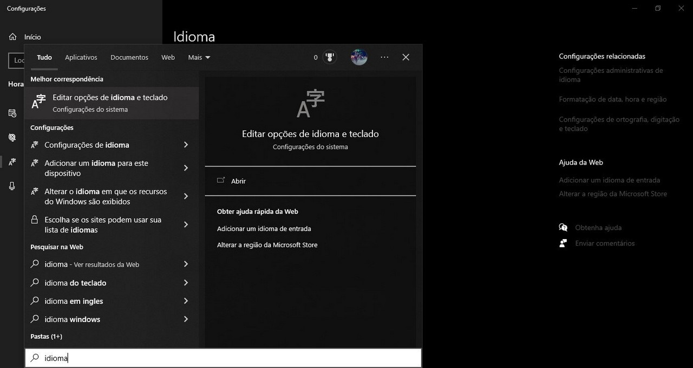

2. Clique em Editar opções de idioma e teclado. Uma nova janela abrirá e na sua parte inferior terá Idiomas preferidos, e caso não exista outro teclado adicionado, apenas a opção Português (Brasil) existirá;

3. Clique em Adicionar um idioma. Uma janela abrirá com o título Escolha um idioma para instalação;

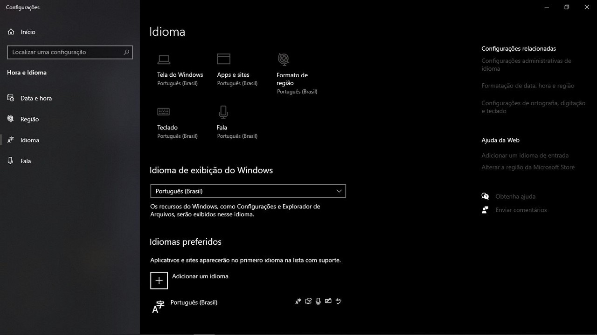

4. Digite japonês na caixa de pesquisa que possui texto Digite o nome de um idioma… Aparecerá apenas uma opção escrita 日本語;

5. Clique na opção 日本語 que aparece logo abaixo da caixa de pesquisa. A opção Avançar aparecerá na parte inferior da janela;

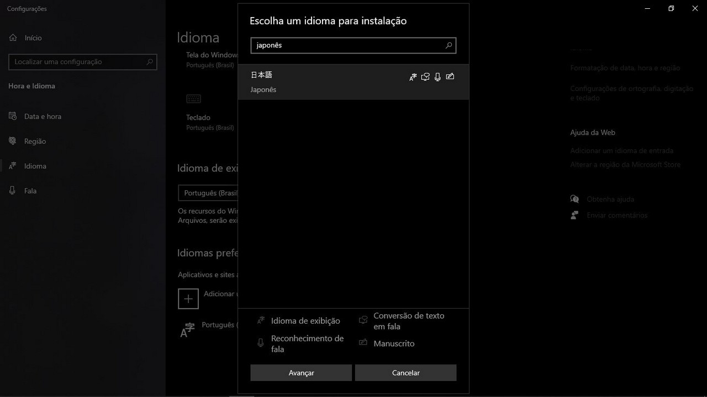

6. Clique na opção Avançar; Caso não tenha uma mesa digitalizadora, o melhor é desmarcar a opção Manuscrito, mas é possível ativar novamente depois;

7. Clique em Instalar. A partir deste momento, o processo de instalação começará, então apenas é preciso esperar para aparecer a nova opção de teclado;

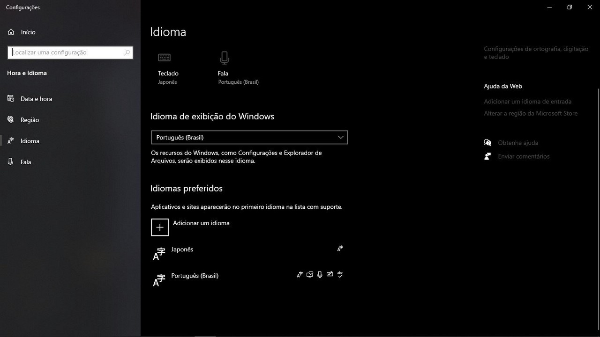

8. E com isso terminamos a instalação do teclado japonês no *Windows*.

Caso seja uma dúvida, esses paços mudam apenas o idioma de entrada do teclado, não o idioma do *Windows*.

### **Utilizando o teclado**
Com o subtópico anterior, apenas instalamos as opções de teclado, mas como fazemos para usá-lo?

É bastante simples.
Ao pressionar o botão com o símbolo do *Windows* do teclado junto com a barra de espaço aparecerá na tela a caixa abaixo.

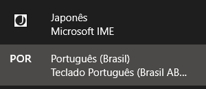

Este atalho alterna entre os teclados ativos no sistema.
A parte acinzentada mais clara representa o teclado escolhido.
Na primeira imagem, o idioma do teclado é o português.
Na segunda, o idioma do teclado é o japonês.

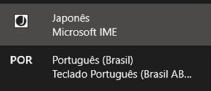

Agora, ao digitar, algumas teclas digitam coisas levemente diferentes.
Por exemplo, ao digitar um **`ç`** aparece um **`ponto e vírgula`**.
O que aconteceu é que o teclado japonês padrão insere apenas em ***`roomaji`***.
A imagem abaixo mostra a barra de tarefas e perceba que agora apareceu um ícone com a letra **`A`** e um ícone com a letra **`J`**.

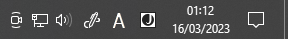

Existem duas formas para inserir textos em ***`hiragana`***, uma é clicar no ícone **A** até aparecer o ***kana* あ** e a outra é pressionar o atalho **Ctrl + CAPS LOCK**.
A barra de tarefas ficará igual à imagem abaixo.

Existem duas formas para inserir textos em ***`katakana`***, uma é clicar no ícone **A** até aparecer o ***kana* カ** e a outra é pressionar o atalho **Alt + CAPS LOCK**.
A barra de tarefas ficará igual à imagem abaixo.

### **Algumas dicas para digitar**
Devemos lembrar dos assuntos abordados na [**Lição 03**](lição03.md), o capítulo sobre as peculiaridades de escrita dos kana.
Para não haver confusão em como digitar, aqui vão algumas dicas:

- Ao escrever **`kanji`** com o teclado para ***`hiragana`*** ativado, aparecerá かんじ mas o texto só será realmente inserido após pressionar **`ENTER`**;
- Ao digitar um texto com o teclado para ***`hiragana`***, antes de pressionar **`ENTER`**, se você pressionar **F7**, o texto mudará para ***`katakana`***, e pressionar F6 retornará para ***`hiragana`***;
- Ao digitar um texto com o teclado para ***`katakana`***, antes de pressionar **`ENTER`**, se você pressionar **`F6`**, o texto mudará para ***`hiragana`***, e pressionar **`F7`** retornará para ***`katakana`***;

De modo geral, para digitar os textos corretamente, a romanização correta precisa ser digitada corretamente.
Por exemplo:
- Para inserir o ***`youon`*** きゃ corretamente, digite **`kya`**;
- Para inserir um ***`chouon`*** かあ corretamente, digite **`kaa`**;
- Para inserir um ***`chouon`*** カー do ***`katakana`*** corretamente, digite **`ka-`**.
Devemos lembrar que o prolongamento correto do ***`katakana`*** é um traço, ou seja, devemos digitar um hífen para aparecer corretamente;
- Para o ***`sokuon`*** de けっけい, digite **`kekkei`**.
Para o ***`sokuon`*** em だった, digite datta.
Para o ***`sokuon`*** em せっしょう, digite **`sesshou`**;
- Para digitar あぁ, digite **`ala`**.
Ou seja, para digitar um caractere pequeno, devemos digitar a letra **`l`** – de lagartixa, para não confundir com um **`i`** maiúsculo – antes da romanização do ***`kana`***.

> **Observações**:
>
> 1. Devemos lembrar que a romanização do ***`sokuon`*** muda conforme o caractere que segue o つ pequeno, por isso a forma de digitar muda conforme a palavra.
> 2. Essa é uma outra forma de digitar o つ pequeno do ***`sokuon`***. Ou seja, para aparecer けっけい em ***`hiragana`***, também é possível se digitarmos **`keltsukei`**.

Tá, mas como digitar os ***`kanji`***?
É bem fácil.
Precisamos apenas pressionar a **`barra de espaço`** antes de pressionar **`ENTER`** pra selecionar o caractere, mas para escolher os ***`kanji`*** corretos após digitar a romanização, precisamos primeiro conhecer os corretos.
Por exemplo, ao digitar ***`kanji`*** com o teclado de ***`hiragana`*** ativado, pressionar a barra de espaços uma vez muda o texto para 漢字, e pressionar uma segunda vez, aparece a caixa da imagem abaixo.

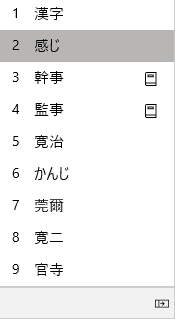

Para mudar entre as opções, utilize a própria barra de espaço ou as teclas direcionais para cima ou para baixo, e para selecionar a opção, pressione **`ENTER`**.

## **Teclado em japonês no dispositivo Android**

Para instalar, basicamente seguimos os mesmos passos: procurar opções de teclado, adicionar um idioma para o teclado e trocar entre os teclados ao digitar.
Os passos do próximo subtópico são em um aparelho Samsung.

### **Configurando o teclado japonês**
Vamos aos seguintes passos:
1. Pesquise por **teclado** nas configurações do aparelho;

2. Clique em **Teclado Samsung**;

3. Clique em Idiomas e Teclados;

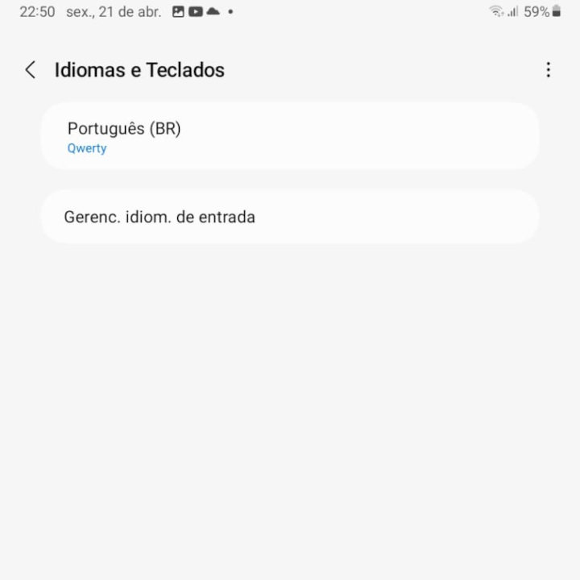

4. Clique em **Gerenc. Idioma de entrada**;

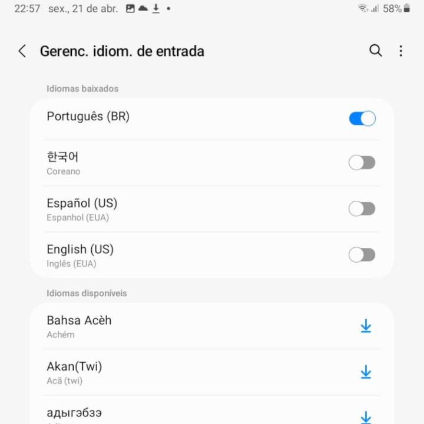

5. Clique no ícone da lupa e digite **japonês**;

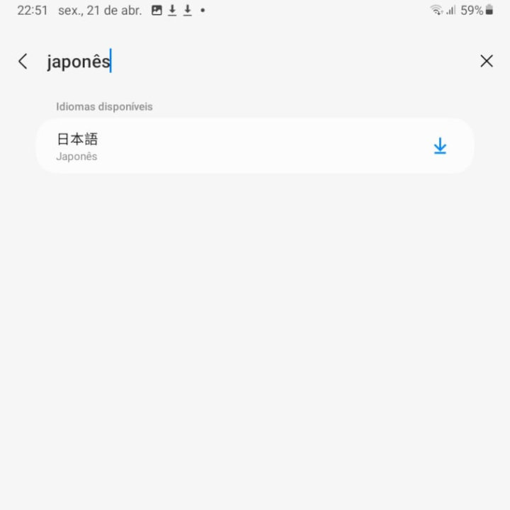

6. Clique na seta de download do lado do texto 日本語.

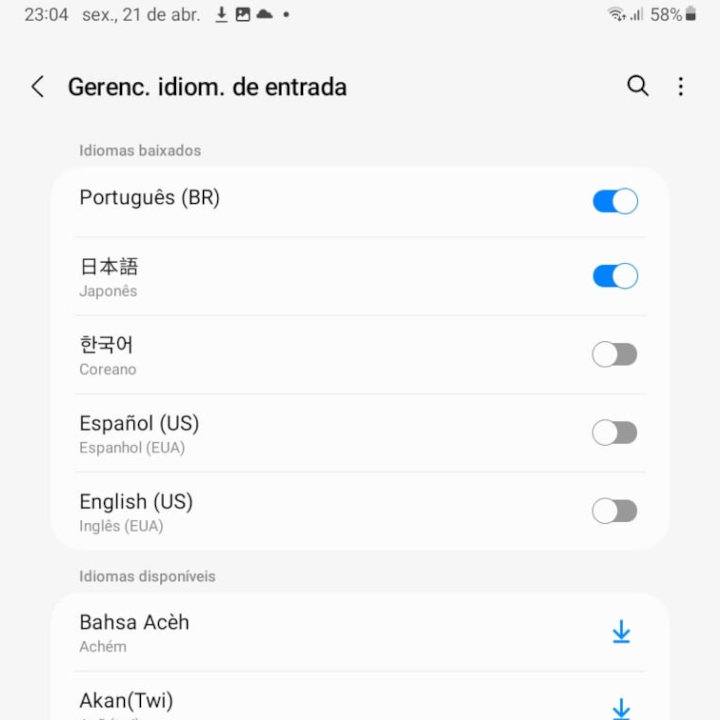

Pronto, o teclado japonês está instalado! Para digitar o texto em japonês ao digitar alguma coisa, pressione o ícone de globo (na imagem está do lado direito do botão com **`www.`**) e quando aparecer **`JA`** na barra de espaço, ao digitar **`nihongo`** o texto de saída será **`にほんご`**.

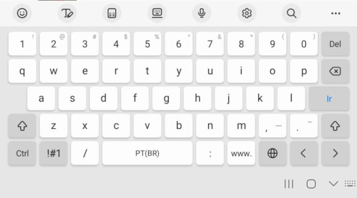
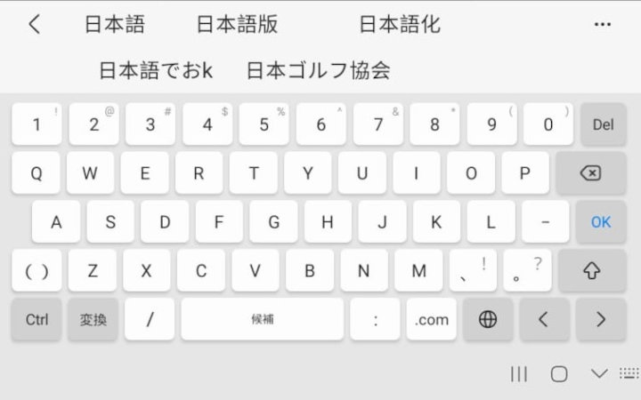

Como podemos observar pela Figura 8, algumas sugestões de opções aparecem logo acima do teclado e ao clicarmos em quaisquer delas, a selecionamos como texto inserido.

## **Segredos de digitação**
Digitar em japonês no computador é fácil de perceber que existem caracteres e figuras tipográficas que não existem no português, mas mesmo que no celular elas não apareçam, não significa que não podemos utilizá-las.

Sem muita enrolação, a lista a seguir mostra como inserir alguns caracteres especiais do japonês – no computador, aparecerá como na figura de sugestão de seleção de ***`kanji`*** e no celular aparecerá como na figura das sugestões de texto:
- ***bikkuri*** (びっくり)  – literalmente ser **`surpreendido`**. O nome não é tão intuitivo assim, mas são exclamações diferentes das que estamos habituados. Ex.: ❕, ⁉, ‼, ❢;
- ***dasshu*** (だっしゅ) – literalmente **`traço`**/**`hífen`**. Como o nome sugere, aparecerá opções de traços e hifens, inclusive o traço ondulado. Ex.: ―, 〜;
- ***hatena*** (はてな) – literalmente **`interrogação`**. Como o nome sugere, aparecerá opções de interrogações diferentes do que estamos habituados no português. Ex.: ❔, ⁇, ‽, ❓;
- ***kakko*** (かっこ) – literalmente **`colchetes`**. Como o nome sugere, aparecerá opções de colchetes diferentes dos que estamos habituados no português. Ex.: 【】,『』, 「」;
- ***maru*** (まる) – literalmente **`círculo`**. Como o nome sugere, aparecerá opções de círculos que não existem no português. Ex.: ◎, ①, ㊤;
- ***yajirushi*** (やじるし) – literalmente **`flechas`**/**`setas`**. Aparece como sugestão, vários tipos de setas. Ex.: ⇒, ⤵, →.

> **Observações**:
>
> 1. O espaço antes e após cada um desses caracteres é realmente maior que o comum. Tecnicamente, quase todas as pontuações e figuras tipográficas no japonês são assim. O segundo e o terceiro grupo de caracteres são equivalente às nossas aspas.
> 2. É possível até mesmo colocar alguns números dentro do círculo, basta digitar **`maru`** e logo em seguida o número, ex.: **`maru1`** insere ①.

Há outros sinais que podem ser inseridos, por exemplo, ***`hoshi`*** – literalmente **`estrela`** – que aparece opções de estrelas e ***`ha-to`*** – literalmente **`coração`** – que aparece opções de corações. Pode ser basicamente qualquer coisa, basta procurar a palavra desejada, e se tiver opções diferentes pra inserção, basta selecionar.

No japão também é muito comum inserir emotes feitos apenas com símbolos, os chamados ***`kaomoji`***. Para inseri-los, basta digitar ***`kaomoji`***, que aparecerá sugestões como:
('ω')ノ　(#^.^#)　(*^▽^*)

## **Notas finais**
Este capítulo foi bem diferente dos outros por não se tratar de dicas explicações acerca do idioma japonês, mas sim algumas dicas e tutorial de como utilizar a escrita japonesa em computadores com Windows 10 e dispositivos móveis Android.

Os tópicos abrangeram apenas esses dois tipos de dispositivos, mas para caso alguém que tenha outro tipo de sistema operacional, como outra versão do Windows ou quaisquer dos dispositivos Apple, o site ToFuGu criou um tutorial completo. Está em inglês mas basta seguir as imagens para conseguir adicionar o teclado em japonês.

Caso tenham interesse em se aprofundar mais sobre o conteúdo, utilize a seguinte lista com as principais referências utilizadas para construção deste capítulo:
1. Fonte com as ordens do traço está em [***Free Japanese Fonts***](https://www.freejapanesefont.com/kanji-stroke-order-font-download/);
2. Link para site com tutorial completo para configurar o teclado em japonês em outros sistemas operacionais: [***ToFuGu***](https://www.tofugu.com/japanese/how-to-install-japanese-keyboard/).

[« Capítulo anterior](lição04.md) |
[Próximo capítulo »](lição06.md)

[Voltar ao README 🡑](../README.md)